# Design Document

## Overview

本文档为"程序员个人品牌网站"（以下简称 Website）的设计方案。Website 采用**静态站点生成（SSG）** 架构：内容以 Markdown / MDX / YAML 文件形式随代码仓库管理，每次 `git push` 触发 CI 构建并部署到 CDN。视觉上以"极简杂志风"为基调，黑白灰为主，大量留白、克制动效、强调排版节奏。

核心设计原则：

1. **内容即代码（Content-as-Code）**：Git 即 CMS，不引入任何后台服务与数据库。
2. **极简克制（Minimal by default）**：调色板不超过 6 色、动效时长 ≤ 300ms、零 JS 默认、每个交互元素的存在都要被质疑一次。
3. **构建时校验（Fail fast at build）**：所有数据文件在构建阶段走 Schema 校验，不合法直接让构建失败，不把错误留给运行时。
4. **零成本运行（Zero ops cost）**：静态产物托管于 Vercel / Cloudflare Pages 免费额度内，分析服务使用无 Cookie 的隐私友好方案。
5. **性能优先（Performance as a feature）**：Lighthouse ≥ 90、LCP ≤ 2.5s，作为硬性指标而非愿望。

本设计覆盖 Requirements 1–22 的全部条款，并在每个章节末尾以"对应 Requirement"形式标注可追溯关系。

---

## Architecture

### 技术栈选型与理由

#### SSG 框架：Astro（推荐） vs Next.js vs Hugo

**选 Astro。**

| 维度 | Astro | Next.js (App Router SSG) | Hugo |
|---|---|---|---|
| 零 JS 默认 | ✅ Islands 架构，页面默认 0 KB JS | ❌ 默认附带 React runtime ~40 KB+ | ✅ 纯 HTML |
| MDX + 组件 | ✅ 一等公民，支持任意 UI 框架组件 | ✅ MDX 支持良好 | ⚠️ shortcodes，不如组件灵活 |
| Content Collections | ✅ 内置 + Zod schema 一体化 | ⚠️ 需自建 | ⚠️ Front Matter 自行约束 |
| 构建速度 | ✅ 约 100 篇文章 < 10s | ⚠️ 中等（React 渲染开销） | ✅ 极快 |
| 生态（shiki / pagefind / sitemap） | ✅ 官方或社区集成齐全 | ✅ 齐全 | ⚠️ 模板系统受限 |
| 学习曲线与维护心智 | ✅ 语法接近 HTML，轻 | ⚠️ 框架较重，App Router 心智负担 | ⚠️ Go 模板语法独特 |

**决策依据**：本站是内容站、首屏几乎无交互（主题切换、搜索、TOC 滚动联动除外），Astro 的 Islands 架构天然契合"默认零 JS，按需激活"的理念；Content Collections + Zod 直接覆盖 Requirement 6、7、8、12 中对"构建时校验失败则中断构建"的硬要求；MDX 支持覆盖 Requirement 5 的代码高亮、数学公式、图片引用。

Next.js 不是不能做，但它把 React runtime 带进每个页面，额外要花精力去砍；Hugo 在"灵活渲染组件 + 严格 Schema 校验"这一组合下不如 Astro 直接。

#### 样式方案：Tailwind CSS + CSS Variables

**选 Tailwind CSS v4（CSS-first 配置）+ 少量全局 CSS Variables。**

- Tailwind 负责布局、间距、原子样式，速度快、产物小（JIT + PurgeCSS）。
- 主题色通过 CSS Variables（`--color-bg`、`--color-fg` ……）定义，`data-theme="dark"` 切换根变量，避免切换主题时重新加载一整套 Tailwind 变体。
- 排版正文走 `@tailwindcss/typography`（`prose` 类），针对极简杂志风做一份覆盖（收紧链接色、压扁标题、削弱引号样式）。

不选纯手写 CSS + BEM：维护成本高，且重复性大；不选 CSS-in-JS：运行时开销与 SSG 理念冲突。

#### 内容层：MDX + Content Collections + Zod

Astro Content Collections 原生支持 Zod schema 对 Front Matter 做校验：Schema 不通过 → `astro build` 非零退出。覆盖 Requirement 6.6、6.7、7.5、7.6、7.7、8.6、12.6、12.8。

#### 搜索：Pagefind

**选 Pagefind。**

| 方案 | 说明 | 取舍 |
|---|---|---|
| Pagefind | 构建后扫描 HTML 生成分片索引，浏览器按需加载（每次查询 < 100 KB） | ✅ 零后端、多语言分词支持、对中文友好（unicode 分词）|
| FlexSearch | 纯 JS 全量索引，文章多了首屏包会膨胀 | ❌ 不适合未来几百篇时 |
| Algolia DocSearch | 免费但要申请，且增加外部依赖 | ❌ 与"零运维"冲突 |

Pagefind 支持 `data-pagefind-body`、`data-pagefind-filter` 注解，用来把 Journal_Entry 也纳入同一个索引（Requirement 15）。

#### 分析：Cloudflare Web Analytics（推荐） / Umami 自托管（备选）

- Cloudflare Web Analytics：免费、无 Cookie、不采集 PII，满足 Requirement 19.2、19.3；只需在 `<head>` 加一行 `<script defer>`。
- Umami：若站主希望仪表盘自托管，可 Docker 部署在自有 VPS，仍无 Cookie 追踪。

不选 Google Analytics：使用 Cookie、采集 PII，与 Requirement 19.2、19.3 冲突。

#### 图片处理：`astro:assets` + Sharp

Astro 内置的 `astro:assets` 在构建时调用 Sharp 生成响应式多尺寸、多格式（AVIF / WebP / 原格式回退）、懒加载、blur placeholder，一步覆盖 Requirement 18.6、18.7、4.10、5.14、12.7、12.9。

#### 字体：Inter（英文） + Noto Sans SC（中文正文） + JetBrains Mono（代码）

| 用途 | 字体 | 理由 |
|---|---|---|
| 英文/数字正文与标题 | Inter Variable | 杂志风常用、字形克制、支持 Variable Font 变重 |
| 中文正文 | Noto Sans SC（subset） | 覆盖完整、开源、与 Inter x-height 相近 |
| 可选中文标题 | 思源宋体 Source Han Serif SC | 给少量大标题带来"杂志感" |
| 代码等宽 | JetBrains Mono Variable | 连字（ligature）、视觉节奏接近 Inter |

全部通过 `@fontsource` 或自托管子集（subset 到常用 ≈ 3500 字 + 标点）方式加载，`font-display: swap` + preload。

#### 部署：Cloudflare Pages（推荐） / Vercel（备选）

- Cloudflare Pages：免费额度大、全球 CDN、自动 HTTPS、Git 集成，原生支持 Pagefind 静态资源分发。
- Vercel：DX 更好但免费额度较紧，且对商业用途有隐形限制。

GitHub Actions 不是必需（平台自带 CI）但用于 **内容校验** 与 **Lighthouse 回归**：PR 触发 lint / typecheck / content-validate / lhci，主分支触发平台部署。

#### PDF 简历：手维护 PDF 文件

**选手维护 `public/resume.pdf`**（静态文件）。

不选 Puppeteer 构建时生成：排版细节难控，且引入重型构建依赖；面试场景下 PDF 排版是"门面"，站主愿意花 30 分钟在 Figma / Typst 里调一版就换一版，远比构建脚本灵活。Resume_Page 的 HTML 时间线仍由 `content/resume.yml` 驱动，PDF 与页面内容保持同步由站主自己约束。覆盖 Requirement 3.3、3.4。

---

### 系统架构图

```mermaid
flowchart LR
    subgraph Author["Content_Author"]
        A1[撰写 .md / .mdx / .yml]
    end

    subgraph Repo["Git 仓库"]
        R1[content/*]
        R2[src/*]
        R3[public/*]
    end

    subgraph CI["Build System (Astro + CI)"]
        B1[Content Collection 校验<br/>Zod schema]
        B2[MDX 管道<br/>shiki / katex / rehype]
        B3[图片生成<br/>astro:assets + Sharp]
        B4[Pagefind 索引生成]
        B5[RSS / sitemap / robots 生成]
        B6[静态 HTML/CSS/JS 产物]
    end

    subgraph CDN["Cloudflare Pages CDN"]
        C1[静态资源分发<br/>HTTPS + 自定义域名]
    end

    subgraph Client["浏览器"]
        U1[初次请求 HTML]
        U2[主题 inline script<br/>防 FOUC]
        U3[Island 激活<br/>搜索/TOC/主题切换]
        U4[按需加载<br/>Pagefind 索引分片]
    end

    A1 -->|git push| R1 & R2 & R3
    R1 & R2 & R3 -->|触发| B1
    B1 -->|校验失败则中断| B1
    B1 --> B2 --> B3 --> B4 --> B5 --> B6
    B6 -->|自动部署| C1
    C1 --> U1 --> U2 --> U3
    U3 --> U4
```



构建阶段任何一步失败（schema 不过、图片路径缺失、date 格式错误……）均以非零退出码中断，平台回滚至上一次成功部署。覆盖 Requirement 20.3、12.6。

---

### 信息架构与路由地图

#### 主导航（固定 7 项）

```
Home  |  About  |  Resume  |  Projects  |  Blog  |  Journal  |  Now
```

#### Overflow "更多" 菜单（Desktop ≥ 1024px 悬停展开；Mobile 折叠菜单内平铺）

```
Skills  |  Uses
```

#### Contact 全局页脚承载，不占导航位。

#### 完整 URL 路由地图

```mermaid
graph TD
    Root[ / 首页]
    About[ /about]
    Resume[ /resume]
    Projects[ /projects]
    ProjectDetail[ /projects/[slug]]
    Blog[ /blog]
    BlogPost[ /blog/[slug]]
    BlogCategory[ /blog/category/[category]]
    BlogTag[ /blog/tag/[tag]]
    Journal[ /journal]
    JournalTag[ /journal/tag/[tag]]
    Now[ /now]
    Skills[ /skills]
    Uses[ /uses]
    Search[ /search]
    NotFound[ /404]
    Feed[ /feed.xml]
    JournalFeed[ /journal/feed.xml]
    Sitemap[ /sitemap.xml]
    Robots[ /robots.txt]
    ResumePDF[ /resume.pdf]

    Root --> About & Resume & Projects & Blog & Journal & Now & Skills & Uses & Search
    Projects --> ProjectDetail
    Blog --> BlogPost & BlogCategory & BlogTag
    Journal --> JournalTag
    Resume --> ResumePDF
```

| 路径 | 类型 | 来源 |
|---|---|---|
| `/` | 静态 | `src/pages/index.astro` |
| `/about` | 静态 | `src/pages/about.astro` + `content/about.mdx` |
| `/resume` | 静态 | `content/resume.yml` |
| `/projects` | 静态 | collection `projects` |
| `/projects/[slug]` | 动态预渲染 | collection `projects` |
| `/blog` | 静态 | collection `blog` |
| `/blog/[slug]` | 动态预渲染 | collection `blog` |
| `/blog/category/[category]` | 动态预渲染 | 聚合自 collection |
| `/blog/tag/[tag]` | 动态预渲染 | 聚合自 collection |
| `/journal` | 静态 | collection `journal` |
| `/journal/tag/[tag]` | 动态预渲染 | 聚合自 collection |
| `/now` | 静态 | `content/now.md` |
| `/skills` | 静态 | `content/skills.yml` |
| `/uses` | 静态 | `content/uses.yml` |
| `/search` | 静态 shell + Pagefind | `src/pages/search.astro` |
| `/404` | 静态 | `src/pages/404.astro` |
| `/feed.xml` | 构建生成 | `@astrojs/rss` |
| `/journal/feed.xml` | 构建生成 | `@astrojs/rss` |
| `/sitemap.xml` | 构建生成 | `@astrojs/sitemap` |
| `/robots.txt` | 静态 | `public/robots.txt` |
| `/resume.pdf` | 静态 | `public/resume.pdf` |

对应 Requirement 11.1、11.2、11.3、11.4、16.1、16.4、17.1、17.2、22.1。

---

## Components and Interfaces

### 目录结构

```
personal-website/
├─ src/
│  ├─ pages/
│  │  ├─ index.astro                # Home
│  │  ├─ about.astro
│  │  ├─ resume.astro
│  │  ├─ now.astro
│  │  ├─ skills.astro
│  │  ├─ uses.astro
│  │  ├─ search.astro
│  │  ├─ 404.astro
│  │  ├─ projects/
│  │  │  ├─ index.astro
│  │  │  └─ [slug].astro
│  │  ├─ blog/
│  │  │  ├─ index.astro
│  │  │  ├─ [slug].astro
│  │  │  ├─ category/[category].astro
│  │  │  └─ tag/[tag].astro
│  │  ├─ journal/
│  │  │  ├─ index.astro
│  │  │  └─ tag/[tag].astro
│  │  ├─ feed.xml.ts                # Blog RSS
│  │  └─ journal/feed.xml.ts        # Journal RSS
│  ├─ layouts/
│  │  ├─ BaseLayout.astro           # <html> / <head> / theme inline script
│  │  ├─ PostLayout.astro           # 博客文章（含 TOC / 阅读进度）
│  │  └─ JournalLayout.astro
│  ├─ components/
│  │  ├─ Nav.astro
│  │  ├─ Footer.astro
│  │  ├─ ThemeToggle.astro          # Island
│  │  ├─ Search.astro               # Island, Pagefind
│  │  ├─ TOC.astro                  # Island
│  │  ├─ ReadingProgress.astro      # Island
│  │  ├─ ProjectCard.astro
│  │  ├─ BlogCard.astro
│  │  ├─ JournalItem.astro          # Island（展开全文）
│  │  ├─ Timeline.astro
│  │  ├─ SkillBar.astro
│  │  ├─ Tag.astro
│  │  └─ Prose.astro
│  ├─ content/
│  │  └─ config.ts                  # Content Collections + Zod schema
│  ├─ lib/
│  │  ├─ readingTime.ts             # 300CPM / 200WPM 估算
│  │  ├─ slugify.ts
│  │  ├─ date.ts
│  │  └─ site.ts                    # 站点配置（姓名、社交链接）
│  ├─ styles/
│  │  ├─ global.css                 # CSS Variables + Tailwind @theme
│  │  └─ prose.css                  # 正文排版覆盖
│  └─ env.d.ts
├─ content/
│  ├─ about.mdx
│  ├─ now.md
│  ├─ resume.yml
│  ├─ skills.yml
│  ├─ uses.yml
│  ├─ site.yml                      # 姓名、身份定位、社交链接
│  ├─ blog/
│  │  ├─ 2025-01-15-first-post.mdx
│  │  └─ images/
│  ├─ projects/
│  │  ├─ project-a.mdx
│  │  └─ images/
│  └─ journal/
│     ├─ 2025-01-15.md
│     └─ 2025-01-16.md
├─ public/
│  ├─ resume.pdf
│  ├─ favicon.svg
│  ├─ og-default.png                # 1200x630 默认 OG 图
│  ├─ avatar.jpg
│  └─ fonts/                        # 自托管字体子集
├─ scripts/
│  ├─ validate-content.ts           # 内容额外校验（死链、图片存在性）
│  └─ og-generate.ts                # 构建时为博客文章生成 OG（satori）
├─ .github/
│  └─ workflows/
│     └─ ci.yml                     # lint / typecheck / validate / lhci
├─ astro.config.mjs
├─ tailwind.config.ts
├─ tsconfig.json
├─ package.json
└─ README.md
```

对应 Requirement 12.1、12.7。

---

### 视觉设计系统

#### 调色板（严格 ≤ 6 色）

**明色主题（`data-theme="light"`，默认）：**

| Token | HEX | 用途 |
|---|---|---|
| `--color-bg` | `#fafafa` | 页面背景，比纯白柔和，减少刺眼 |
| `--color-fg` | `#0a0a0a` | 主前景（正文、标题），比纯黑低对比 |
| `--color-fg-muted` | `#6b7280` | 次级前景（元信息、日期、面包屑） |
| `--color-border` | `#e5e7eb` | 分隔线、卡片边界（极细） |
| `--color-accent` | `#1f2937` | 链接、当前活动态（near-black 的冷色倾） |
| `--color-code-bg` | `#f4f4f5` | 代码块底色，比 `--color-bg` 略深 |

**暗色主题（`data-theme="dark"`）：**

| Token | HEX | 用途 |
|---|---|---|
| `--color-bg` | `#0a0a0a` | 深背景 |
| `--color-fg` | `#fafafa` | 主前景 |
| `--color-fg-muted` | `#9ca3af` | 次级前景 |
| `--color-border` | `#27272a` | 分隔线 |
| `--color-accent` | `#e5e7eb` | 链接 |
| `--color-code-bg` | `#18181b` | 代码块底色 |

**理由**：`#0a0a0a`/`#fafafa` 两个"近黑"/"近白"组合在两个主题下保持视觉一致性（Linear、Vercel、Brittany Chiang 均采用同款方案）；纯 `#000` 在 OLED 屏幕上对比太强，长文阅读易疲劳。对比度：`#0a0a0a` on `#fafafa` ≈ 19.8:1，`#fafafa` on `#0a0a0a` ≈ 19.8:1，`#6b7280` on `#fafafa` ≈ 5.3:1，均满足 WCAG AA（Requirement 21.4）。

#### 字体系统

```css
:root {
  --font-sans: "Inter Variable", "Noto Sans SC", -apple-system, system-ui, sans-serif;
  --font-serif: "Source Han Serif SC", Georgia, serif; /* 仅大标题可选 */
  --font-mono: "JetBrains Mono Variable", "Cascadia Code", Consolas, monospace;

  /* Modular Scale, ratio = 1.25 (Major Third) */
  --text-xs:   0.75rem;    /* 12px */
  --text-sm:   0.875rem;   /* 14px */
  --text-base: 1rem;       /* 16px — 正文基准，满足 Requirement 13.5 */
  --text-lg:   1.125rem;   /* 18px */
  --text-xl:   1.25rem;    /* 20px */
  --text-2xl:  1.5rem;     /* 24px */
  --text-3xl:  1.875rem;   /* 30px */
  --text-4xl:  2.25rem;    /* 36px */

  --leading-tight: 1.25;
  --leading-normal: 1.5;
  --leading-relaxed: 1.75; /* 正文 */

  --weight-regular: 400;
  --weight-medium: 500;
  --weight-semibold: 600;
}
```

字重策略：极简风**只用三种字重**——400（正文）、500（次级标题 / 导航高亮）、600（大标题）。不使用 700/800 字重。

#### 间距与排版节奏

- **基准网格**：8px（`0.5rem`）。所有 padding/margin 使用 4/8/12/16/24/32/48/64/96 的 4px 倍数。
- **正文最大宽度**：`--prose-width: 68ch`（约 680px，对应 Requirement 13.4 的 65–80 字符行宽）。
- **内容左右留白**：Desktop 下页面主体居中，两侧留白 ≥ `max(10vw, 48px)`（Requirement 14.8）。

```css
.container {
  margin-inline: auto;
  max-width: 72rem;  /* 1152px 外层 */
  padding-inline: max(10vw, 1.5rem);
}
.prose-container {
  max-width: 68ch;
  margin-inline: auto;
}
```

#### 响应式断点

| 断点 | 区间 | 布局策略 |
|---|---|---|
| Mobile | `< 768px` | 单列、折叠导航、正文 `px-6` |
| Tablet | `768–1024px` | 单列为主、导航展开、正文 `px-8` |
| Desktop | `> 1024px` | 单列居中、两侧留白 ≥ 10vw |

刻意不做多列 Grid：杂志风的"杂志感"来自**排版而非分栏**，多列会引入复杂响应式工作。

#### 动效原则

- **时长**：`--duration-fast: 120ms`，`--duration-base: 200ms`，**上限 300ms**（Requirement 14.6）。
- **缓动**：`--ease-out: cubic-bezier(0.16, 1, 0.3, 1)`（自然减速）；不使用 bounce / elastic。
- **触发条件**：仅用于 ①主题切换 ②Mobile 菜单展开 ③搜索框聚焦 ④悬停链接下划线。**禁止**滚动视差、页面切换转场、装饰性浮动。
- 尊重 `prefers-reduced-motion: reduce` → 所有过渡 `duration: 0.01ms`。

对应 Requirement 14.5、14.6、14.7、14.8、13.4、13.5。

---

### 页面布局设计

#### Home_Page（`/`）

```
┌───────────────────────────────────────────────────────────┐
│  [Nav: Home · About · Resume · Projects · Blog · Journal │
│        · Now              · · · Search · ThemeToggle ]   │
├───────────────────────────────────────────────────────────┤
│                                                           │
│                                                           │
│        姓名                                                │
│        一句话身份定位                                       │
│                                                           │
│        一段 < 200 字的自我介绍，冷静克制，不堆形容词。        │
│                                                           │
│        [ TypeScript ] [ Rust ] [ Distributed Systems ]   │
│                                                           │
│        → 看看我现在在做什么 /now                            │
│                                                           │
│    · · · · · · · · · · · · · · · · · · · · · · · · · ·   │
│                                                           │
│    近期项目                               查看全部 →         │
│    ┌─────────┐  ┌─────────┐  ┌─────────┐                │
│    │ Proj A  │  │ Proj B  │  │ Proj C  │                │
│    └─────────┘  └─────────┘  └─────────┘                │
│                                                           │
│    近期文章                               查看全部 →         │
│    2025-01-15  标题一                                      │
│    2025-01-10  标题二                                      │
│    ...                                                    │
│                                                           │
│    近期日志                               查看全部 →         │
│    2025-01-20  今天修了一个奇怪的 timezone bug...          │
│    ...                                                    │
│                                                           │
├───────────────────────────────────────────────────────────┤
│   Footer: Contact + Copyright + RSS                      │
└───────────────────────────────────────────────────────────┘
```

**关键决策**：
- Hero 区域**不做任何背景色块或图形装饰**——留白即是版式语言。
- 姓名用 `--text-3xl` + weight 500；身份定位用 `--text-xl` + `--color-fg-muted`。
- "近期 N 项"标题用 `--text-sm` + `uppercase` + `letter-spacing: 0.1em`，压低视觉权重（杂志眉题感）。
- Desktop 首屏不滚动即可见 Hero 完整内容（Requirement 1.8），通过 `min-height: 100svh` 配合 Hero 内 padding 实现。
- 若某分区无内容（Requirement 1.9），渲染固定占位"尚无内容，敬请期待"并保留区块标题与列表页入口。

对应 Requirement 1.1–1.9。

#### About_Page（`/about`）

```
┌───────────────────────────────────────────────────────────┐
│ Nav                                                       │
├───────────────────────────────────────────────────────────┤
│                                                           │
│    [  头像  ]    关于我                                    │
│                                                           │
│    ## 职业背景                                             │
│    正文段落 ...                                            │
│                                                           │
│    ## 职业故事                                             │
│    正文段落 ...                                            │
│                                                           │
│    ── 价值观 ──                                            │
│    · 条目 1                                                │
│    · 条目 2                                                │
│    · 条目 3                                                │
│                                                           │
│    ── 技术兴趣 ──                                           │
│    · ...                                                   │
│                                                           │
│    ── 非技术兴趣 ──                                         │
│    · ...                                                   │
│                                                           │
├───────────────────────────────────────────────────────────┤
│ Footer (含 Contact)                                       │
└───────────────────────────────────────────────────────────┘
```

**决策**：头像圆角 12px、非圆形（杂志风）；alt 文本非空（Requirement 2.2）；加载失败显示占位 SVG（Requirement 2.3）；三块"价值观/技术兴趣/非技术兴趣"每块 ≥ 3 条（Requirement 2.4）。

对应 Requirement 2.1–2.5。

#### Resume_Page（`/resume`）

```
┌───────────────────────────────────────────────────────────┐
│ Nav                                                       │
├───────────────────────────────────────────────────────────┤
│                                                           │
│    工作经历                     [  下载 PDF 简历 ]         │
│                                                           │
│    ┃  2023.06 — 至今                                       │
│    ┃  公司 A · 高级工程师                                  │
│    ┃  职责描述（50–500 字符）...                            │
│    │                                                      │
│    ┃  2021.01 — 2023.05                                   │
│    ┃  公司 B · 工程师                                      │
│    ┃  ...                                                 │
│                                                           │
│    教育经历                                                │
│    ┃  2017.09 — 2021.06                                   │
│    ┃  某大学 · 计算机科学 · 本科                            │
│                                                           │
├───────────────────────────────────────────────────────────┤
│ Footer                                                    │
└───────────────────────────────────────────────────────────┘
```

"下载 PDF 简历" 按钮在 Desktop 上 `position: sticky; top: 6rem`，Mobile 上固定在时间线上方。PDF 文件名 `${name}-resume.pdf`（Requirement 3.4）。若 fetch 失败（HEAD 预检 404）展示失败提示且保留按钮（Requirement 3.5）。

对应 Requirement 3.1–3.5。

#### Projects_Page & Project_Detail_Page

```
Projects_Page (/projects):
┌──────────────────────────────────────────────────────────┐
│ Nav                                                      │
├──────────────────────────────────────────────────────────┤
│  项目                                                     │
│  ┌────────────────┐ ┌────────────────┐                  │
│  │  [封面 16:9]   │ │  [封面 16:9]   │                  │
│  │  项目名         │ │  项目名        │                  │
│  │  一句话简介...   │ │  一句话简介... │                  │
│  │  #tag #tag     │ │  #tag #tag    │                  │
│  │  [Demo] [Repo] │ │  [Demo] [Repo]│                   │
│  └────────────────┘ └────────────────┘                  │
└──────────────────────────────────────────────────────────┘

Project_Detail_Page (/projects/[slug]):
┌──────────────────────────────────────────────────────────┐
│ Nav                                                      │
├──────────────────────────────────────────────────────────┤
│  项目名                                                   │
│  一句话简介                                                │
│  [ stack1 · stack2 · stack3 ]       [Demo ↗] [Repo ↗]  │
│                                                          │
│  ## 项目背景与要解决的问题                                  │
│  ## 技术架构与选型理由                                      │
│  ## 我的角色与个人贡献                                      │
│  ## 项目成果或影响指标                                      │
└──────────────────────────────────────────────────────────┘
```

卡片网格 Desktop 2 列、Tablet 2 列、Mobile 1 列；按日期倒序，同日按名称升序（Requirement 4.2）。Demo/Repo 链接 `target="_blank" rel="noopener"`（Requirement 4.6）；缺失 Demo 或 Repo 则不渲染对应按钮（Requirement 4.3、4.4）。缺失封面时用 `og-default.png` 裁剪版（Requirement 4.10）。详情页四个章节顺序由 MDX 模板强制（内容校验脚本检查 H2 标题序列，见 §12.1）（Requirement 4.7、4.8）。

对应 Requirement 4.1–4.12。

#### Blog_List_Page & Blog_Post_Page

```
Blog_List_Page (/blog):
┌──────────────────────────────────────────────────────────┐
│ Nav                                                      │
├──────────────────────────────────────────────────────────┤
│  博客                                                     │
│  ── 分类 ──   [全部]  [前端]  [后端]  [架构]               │
│  ── 标签 ──   #ts #rust #dx ...                          │
│                                                          │
│  2025-01-15  · 前端 · 标题一                               │
│               #ts #dx                                    │
│               文章摘要（≤ 150 字符）...                     │
│               ── ─ ─ ─ ─ ─ ─ ─ ─ ─ ─ ─ ─ ─ ─ ─ ─ ─ ──    │
│                                                          │
│  2025-01-10  · 架构 · 标题二 ...                           │
└──────────────────────────────────────────────────────────┘
```

**决策**：Category 与 Tag 筛选使用**顶部 Pills**（不使用侧边栏）——更契合杂志风的"单栏纵向流"；Pills 点击后导航至 `/blog/category/[x]` 或 `/blog/tag/[x]` 子页（URL 可分享、可索引），比客户端 filter 更 SEO 友好，代价是点击时一次导航。

```
Blog_Post_Page (/blog/[slug]):
┌────────────────────────────────────────────────────────────┐
│ [ReadingProgress: ━━━━━━━━━━━━━━░░░░░░░░░░░░ 43% ]        │
├────────────────────────────────────────────────────────────┤
│ Nav                                                        │
├────────────────────────────────────────────────────────────┤
│                                      ┌─TOC─────────────┐  │
│  标题                                 │ · H2 第一节       │  │
│  2025-01-15 · 更新 2025-02-01        │   · H3 子节       │  │
│  · 前端 · 8 分钟 · #ts #dx           │ · H2 第二节       │  │
│                                      │ · H2 结论         │  │
│  正文 prose，行宽 68ch ...            └─ sticky top:6rem─┘  │
│  ```ts                                                     │
│  // shiki 高亮                                              │
│  ```                                                       │
│  $$ E = mc^2 $$ (katex)                                    │
│                                                            │
└────────────────────────────────────────────────────────────┘
```

- TOC（Requirement 5.9）仅 Desktop 显示，Mobile/Tablet 折叠为顶部 `<details>`。
- 阅读进度条（Requirement 5.10）基于 `IntersectionObserver` 监控正文容器边界，百分比取整。
- 阅读时长（Requirement 5.11）公式：`Math.ceil(zhChars/300 + enWords/200)`。
- 代码高亮用 shiki（支持九种语言 + 通用 `text`），无语言标记降级纯等宽（Requirement 5.7）。
- 数学公式用 rehype-katex（Requirement 5.8）。

对应 Requirement 5.1–5.15。

#### Skills_Page

```
┌──────────────────────────────────────────────────────────┐
│ Nav                                                      │
├──────────────────────────────────────────────────────────┤
│  技能                                                     │
│  ── 编程语言 ──                                            │
│    TypeScript      ████████████░░  6 年                   │
│    Rust            ██████░░░░░░░░  熟练                   │
│  ── 框架/库 ──                                            │
│    React           ████████░░░░░░  5 年                   │
│    Astro           ████░░░░░░░░░░  掌握                   │
│  ── 工具 ──                                               │
│    Vim             ██████████░░░░  熟练                   │
│  ── 基础设施/云服务 ──                                      │
│    AWS             ███████░░░░░░░  掌握                   │
│  ── 其他 ──                                                │
│    ...                                                    │
└──────────────────────────────────────────────────────────┘
```

熟练度可视化：不管哪种取值形式（年限 / 档位 / 百分比），都**映射到同一条 0–100 的条形**进行可比较展示——年限按 `min(years/10, 1) * 100`；档位 `熟练=90 / 掌握=60 / 了解=30`；百分比直出。条形条数为 14 格灰阶块，保持杂志风（不用进度条渐变色）。

对应 Requirement 6.1–6.7。

#### Now_Page

```
┌──────────────────────────────────────────────────────────┐
│ Nav                                                      │
├──────────────────────────────────────────────────────────┤
│                                                          │
│  最后更新：2025-01-15                                      │
│  [⚠ 内容可能已过时 — 超过 90 天未更新]  (仅超期时显示)     │
│                                                          │
│  ## 现在在做                                               │
│    · ...                                                 │
│                                                          │
│  ## 现在在学                                               │
│    · ...                                                 │
│                                                          │
│  ## 现在在关注                                             │
│    · ...                                                 │
└──────────────────────────────────────────────────────────┘
```

三板块二级标题顺序强制（Requirement 7.1），由内容校验脚本对 `now.md` AST 的 H2 序列做精确比对（§12.1）。过期提示条视觉上是 `--color-border` 细框 + 左侧 4px `--color-accent` 竖线，不用黄色或红色——保持色板约束。

对应 Requirement 7.1–7.7。

#### Uses_Page

```
┌──────────────────────────────────────────────────────────┐
│ Nav                                                      │
├──────────────────────────────────────────────────────────┤
│  日常在用                                                 │
│  ── 硬件 ──                                               │
│    MacBook Pro 14"      一句话评价          [官网 ↗]      │
│    HHKB Professional    一句话评价                        │
│  ── 软件/开发工具 ──                                       │
│    Ghostty              ...                              │
│  ── 书籍 ──                                               │
│  ── 课程/文章推荐 ──                                       │
└──────────────────────────────────────────────────────────┘
```

空分组不渲染（Requirement 8.7）；外链新标签页打开（Requirement 8.5）；无外链则不渲染链接元素（Requirement 8.3）。

对应 Requirement 8.1–8.7。

#### Journal_List_Page

```
┌──────────────────────────────────────────────────────────┐
│ Nav                                                      │
├──────────────────────────────────────────────────────────┤
│  日志             [全部]  #bug #reading #thought          │
│                                                          │
│  2025-01-20 · #bug                                       │
│  今天修了一个奇怪的 timezone bug，起因是 ...                │
│  ... (超过 120 字符 → 展开全文)                             │
│                                                          │
│  2025-01-19 · #reading                                   │
│  读到一段关于 ... (短条目整条展示)                           │
│                                                          │
└──────────────────────────────────────────────────────────┘
```

标签筛选通过 `/journal/tag/[tag]` 子路由（与博客一致）；"展开全文"作为一个轻量 Island（`<details>`/JS），展开后原位渲染完整 Markdown（Requirement 9.7、9.8）。

对应 Requirement 9.1–9.11。

#### 404 页

```
┌──────────────────────────────────────────────────────────┐
│ Nav                                                      │
├──────────────────────────────────────────────────────────┤
│                                                          │
│            404                                           │
│            这里什么都没有。                                 │
│                                                          │
│            回到首页 · 去看看博客 · 去看看日志                │
│                                                          │
└──────────────────────────────────────────────────────────┘
```

对应 Requirement 22.1–22.4。

#### Global_Footer

```
┌──────────────────────────────────────────────────────────┐
│   [姓名] · 一句话身份定位                                  │
│                                                          │
│   email@example.com                                      │
│   GitHub · LinkedIn · Twitter                            │
│                                                          │
│   © 2025 · RSS · Journal RSS · Sitemap                   │
└──────────────────────────────────────────────────────────┘
```

社交链接未配置则不渲染（Requirement 10.8）；邮箱 `mailto:` 点击后若无邮件客户端响应（通过 `visibilitychange` 500ms 未切走判定），弹出可复制邮箱的 toast（Requirement 10.9）。

对应 Requirement 10.1–10.10、11.4、16.6、22.1。

#### Navigation_Bar

```
Desktop (≥1024px):
┌──────────────────────────────────────────────────────────┐
│ NAME.      Home  About  Resume  Projects  Blog  Journal  │
│            Now             More▾    🔍 Search  ☀/☾       │
└──────────────────────────────────────────────────────────┘

Tablet/Mobile (<1024px):
┌──────────────────────────────────────────────────────────┐
│ NAME.                                    🔍   ☀/☾   ☰   │
└──────────────────────────────────────────────────────────┘
(点击 ☰ 展开全部入口：Home · About · Resume · Projects ·
 Blog · Journal · Now · Skills · Uses)
```

当前页入口以 `--color-accent` 加 1px 下划线区分（Requirement 11.8）。所有页面导航结构一致（Requirement 11.7），由 `BaseLayout` 强制注入。

对应 Requirement 11.1–11.8。

---

## Data Models

所有 schema 在 `src/content/config.ts` 中以 **Zod** 定义，由 Astro Content Collections 在 `astro build` 阶段强制校验；任何字段缺失或越界即构建失败。

### Blog Post

```ts
// src/content/config.ts
import { defineCollection, z } from "astro:content";

const blog = defineCollection({
  type: "content",
  schema: ({ image }) => z.object({
    title: z.string().min(1).max(200),                  // Req 12.2
    date: z.string().regex(/^\d{4}-\d{2}-\d{2}$/),      // Req 12.2, Req 5.1
    updated: z.string().regex(/^\d{4}-\d{2}-\d{2}$/).optional(), // Req 5.11
    category: z.string().min(1).max(50),                // Req 12.2
    tags: z.array(z.string().max(50)).max(20).default([]),
    summary: z.string().min(1).max(500),                // Req 12.2 + Req 5.1 列表摘要 ≤ 150 取前 150
    draft: z.boolean().default(false),                  // Req 12.4
    cover: image().optional(),                          // 可选封面
  }),
});
```

### Project

```ts
const projects = defineCollection({
  type: "content",
  schema: ({ image }) => z.object({
    title: z.string().min(1).max(60),                   // Req 4.1
    date: z.string().regex(/^\d{4}-\d{2}-\d{2}$/),      // Req 4.2
    summary: z.string().min(1).max(120),                // Req 4.1 一句话简介
    stack: z.array(z.string()).max(6),                  // Req 4.1 卡片标签
    fullStack: z.array(z.string()).min(1),              // Req 4.8 详情页完整栈
    demo: z.string().url().optional(),                  // Req 4.3
    repo: z.string().url().optional(),                  // Req 4.4
    cover: image().optional(),                          // Req 4.10
    draft: z.boolean().default(false),
  }),
});
```

### Journal Entry

```ts
const journal = defineCollection({
  type: "content",
  schema: z.object({
    date: z.string().regex(/^\d{4}-\d{2}-\d{2}$/),      // Req 12.3
    tags: z.array(z.string().max(50)).max(20).optional(), // Req 9.4, 12.3
    draft: z.boolean().default(false),                   // Req 12.3, Req 9.1
  }),
});
```

### Now

```ts
// 单文件 content/now.md
const now = defineCollection({
  type: "content",
  schema: z.object({
    lastUpdated: z.string().regex(/^\d{4}-\d{2}-\d{2}$/), // Req 7.3, 7.5
  }),
});
```

构建脚本对 `lastUpdated` 做额外校验：`lastUpdated <= buildDate`（否则 fail，Req 7.7）；`now.md` 必存在（否则 fail，Req 7.6）；AST 中 H2 节点必为 `["现在在做","现在在学","现在在关注"]` 的精确有序序列（Req 7.1）。

### Skills

```ts
// content/skills.yml
const skills = defineCollection({
  type: "data",
  schema: z.object({
    groups: z.array(z.object({
      category: z.enum(["编程语言", "框架/库", "工具", "基础设施/云服务", "其他"]), // Req 6.1
      items: z.array(z.object({
        name: z.string().min(1).max(40),                // Req 6.3
        proficiency: z.discriminatedUnion("kind", [
          z.object({ kind: z.literal("years"),   value: z.number().int().min(0).max(50) }),
          z.object({ kind: z.literal("level"),   value: z.enum(["熟练", "掌握", "了解"]) }),
          z.object({ kind: z.literal("percent"), value: z.number().int().min(0).max(100) }),
        ]),                                              // Req 6.2
      })).min(1),                                        // 已展示分组 ≥ 1 项
    })),
  }),
});
```

YAML 示例：

```yaml
groups:
  - category: 编程语言
    items:
      - name: TypeScript
        proficiency: { kind: years, value: 6 }
      - name: Rust
        proficiency: { kind: level, value: 熟练 }
  - category: 框架/库
    items:
      - name: Astro
        proficiency: { kind: percent, value: 70 }
```

### Uses

```ts
const uses = defineCollection({
  type: "data",
  schema: z.object({
    groups: z.array(z.object({
      category: z.string().min(1),                       // Req 8.1（至少 4 类由数据保证）
      items: z.array(z.object({
        name: z.string().min(1).max(100),                // Req 8.2
        note: z.string().min(1).max(200),                // Req 8.2 一句话评价
        url: z.string().url().optional(),                // Req 8.3
      })).default([]),
    })),
  }),
});
```

### Resume

```ts
const resume = defineCollection({
  type: "data",
  schema: z.object({
    work: z.array(z.object({
      company: z.string().min(1),
      role: z.string().min(1),
      start: z.string().regex(/^\d{4}-\d{2}$/),          // Req 3.1
      end: z.union([z.string().regex(/^\d{4}-\d{2}$/), z.literal("至今")]),
      description: z.string().min(50).max(500),          // Req 3.1
    })),
    education: z.array(z.object({
      school: z.string().min(1),
      major: z.string().min(1),
      degree: z.string().min(1),
      start: z.string().regex(/^\d{4}-\d{2}$/),
      end: z.union([z.string().regex(/^\d{4}-\d{2}$/), z.literal("至今")]),
    })),
  }),
});
```

### Site Config

```ts
const site = defineCollection({
  type: "data",
  schema: z.object({
    name: z.string().min(1).max(50),                     // Req 1.1
    tagline: z.string().min(1).max(50),                  // Req 1.1
    intro: z.string().min(1).max(200),                   // Req 1.1
    heroTags: z.array(z.string().max(20)).min(1).max(5), // Req 1.2
    nowLinkText: z.string().min(1).max(20),              // Req 1.3
    url: z.string().url(),
    email: z.string().email(),                            // Req 10.1
    social: z.object({
      github: z.string().url().optional(),                // Req 10.2
      linkedin: z.string().url().optional(),              // Req 10.3
      twitter: z.string().url().optional(),               // Req 10.4
    }),
  }),
});
```

对应 Requirement 12.1–12.9、6.1–6.7、8.1–8.7、9.1–9.5、3.1–3.2、1.1–1.9、10.1–10.8。

---

## Correctness Properties

*属性（Property）是在系统所有合法执行中都应成立的特征或行为——一种关于"软件应当做什么"的形式化陈述。属性把人类可读的规格与机器可验证的正确性保证连接起来。*

下列 20 条属性从 Requirements 的所有可测 Acceptance Criteria 中归并而来（详见 Prework 分析）；每一条都给出"for all"式的通用表述与可行的测试切入点（HTML 产物遍历、数据校验脚本、Playwright 渲染断言等），并标注所验证的 Requirement 条目。

### Property 1: Collection 列表渲染不变量（排序 + 截断 + 草稿过滤）

*For any* content collection C 与渲染槽位截断上限 K（Home 最近项目 K=3、最近文章 K=5、最近日志 K=3、Blog RSS K=20、Journal RSS K=20、列表页 K=∞），所渲染的条目序列应等于 `take(K, sortDesc(filter(e => !e.draft, C)))`；即：长度 ≤ min(K, 非草稿条目数)、按 `date` 单调不增；对 `projects` 同日再按 `title` 升序作为 tiebreaker。

**测试切入点**：随机生成若干 collection entry（含 draft、重复日期），执行构建后解析 HTML 列表容器，对 DOM 顺序做日期单调性与长度上界断言。

**Validates: Requirements 1.4, 1.5, 1.6, 3.1, 3.2, 4.2, 5.1, 9.1, 9.11, 16.2**

### Property 2: Front Matter Schema 构建期校验不变量

*For any* Content_File（blog / project / journal / skills / uses / now / resume / site）与其 Front Matter 或 YAML 数据：若数据满足本文件 §Data Models 中声明的 Zod schema，`astro build` 成功退出（code = 0）；否则 `astro build` 非零退出，且标准错误中包含失败字段路径与文件路径。

**测试切入点**：随机生成合法与非法 Content_File（字段缺失、越界、格式错误），对每组运行 `astro build`，断言退出码与错误消息内容。

**Validates: Requirements 6.2, 6.3, 6.6, 6.7, 7.3, 7.5, 7.6, 7.7, 8.2, 8.6, 9.2, 10.1, 12.2, 12.3, 12.6, 12.8**

### Property 3: Draft 排除全局不变量

*For any* Content_File e with `e.draft === true`，构建产物中：
- 不存在对应的 `/blog/[slug]`、`/projects/[slug]`、`/journal` 正文渲染
- 不出现在任何列表页（Home 近期区块、`/blog`、`/projects`、`/journal`、任意 category/tag 聚合页）
- 不出现在 `/feed.xml` 与 `/journal/feed.xml`
- 不出现在 `/sitemap.xml`
- 不出现在 Pagefind 搜索索引

**测试切入点**：生成含若干 draft 与非 draft 混合的 collection，构建后遍历 dist/ 目录，对每个 draft entry 的 slug 与 title 在所有产物中做全文反向检查。

**Validates: Requirements 9.1, 12.4, 16.2, 17.1**

### Property 4: 全局 Nav 与 Footer 结构一致性

*For all* 公开 HTML 页面集合 P，提取其 `<nav>` 与 `<footer>` 子树后（剔除 active 标记），两两的 DOM 序列化结果应完全相等；`<nav>` 主入口恰好 7 项且顺序为 [Home, About, Resume, Projects, Blog, Journal, Now]；`<footer>` 包含 Contact_Section 且至少一项联系方式。

**测试切入点**：构建后遍历所有 `*.html` 文件，解析 AST 后对 nav/footer 做规范化序列化，断言集合大小为 1；Footer 必含 `mailto:` 或 social 链接之一。

**Validates: Requirements 2.5, 10.5, 11.1, 11.2, 11.3, 11.4, 11.7, 11.8, 22.2, 22.3, 22.4**

### Property 5: 外链新标签页不变量

*For any* `<a>` 元素出现在构建产物中，若其 `href` 绝对化后的 origin 与站点 origin 不同，则：`a.target === "_blank"` 且 `a.rel` 的 token 集合包含 `"noopener"`。

**测试切入点**：构建后遍历所有 HTML，过滤出外链 `<a>` 并断言属性；可随机生成项目/博客中引用外链的 entry 做正例验证。

**Validates: Requirements 4.6, 8.5, 10.7**

### Property 6: 图片 alt 与资源存在性不变量

*For any* `` 元素出现在构建产物中：
- `alt` 属性必被显式声明（允许空串，但不允许 undefined）
- 若 `src` 为内部路径（以 `/` 开头或相对于产物的路径），对应文件必存在于 dist/ 中
- 若 `src` 为外部 URL，必为语法合法的 HTTPS URL

**测试切入点**：构建后遍历 dist/ 中所有 HTML，对每个 `` 执行属性与文件存在性检查；对随机项目/博客中引用的相对路径图片做正例与负例（不存在路径 → 构建失败）验证。

**Validates: Requirements 2.2, 5.12, 12.7, 12.9, 21.1**

### Property 7: 条件字段 ⇔ UI 元素存在

*For any* Content_File entry e 与可选字段 f（如 `demo`、`repo`、`social.github`、`social.linkedin`、`social.twitter`、`uses.item.url`、`journal.tags`）：e 中 f 被设置为非空值 ⇔ 对应 UI 元素（`selectorOf(f)`）在渲染产物中存在。

*For any* collection C：若 `filter(e => !e.draft, C).length === 0`，则对应列表页 / Home 区块 / Uses 分组应渲染占位文本（长度 1–50）或不渲染分组标题（Uses 情形）。

**测试切入点**：随机生成 entries，对每个可选字段的开关组合枚举断言 UI 元素存在性；对空 collection 断言占位或隐藏。

**Validates: Requirements 1.9, 4.3, 4.4, 4.12, 5.13, 8.3, 8.7, 9.4, 9.9, 10.8**

### Property 8: 死链闭合不变量（内部链接可达性）

*For any* `<a>` 元素出现在构建产物中，若其 `href` 为内部路径，则该路径在构建产物的路由集合中存在（对 `/` 收尾与 `index.html` 做归一化）；fragment（`#id`）若存在，则该 `id` 必定义于目标页面的某个元素上。

**测试切入点**：独立的 `scripts/check-links.ts` 在 `astro build` 后跑；遍历 dist/ 所有 HTML，解析所有内链 href，断言目标存在；对随机 collection 做负例（注入未解析相对 link）验证构建失败。

**Validates: Requirements 12.1, 12.7, 12.9, 22.1**

### Property 9: SEO 元数据完备性

*For all* 公开 HTML 页面 P：
- `<title>` 存在且非空；集合 `{title(p) | p ∈ P}` 两两互异
- `<meta name="description">` 存在且非空
- `<meta property="og:{title,description,type,url,image}">` 五项齐全
- `<meta name="twitter:{card,title,description,image}">` 四项齐全
- 不存在 `<meta name="robots" content="noindex">`
- 存在两个 `<link rel="alternate" type="application/rss+xml">` 分别指向 `/feed.xml` 与 `/journal/feed.xml`

**测试切入点**：构建后遍历所有 HTML，对 head 做多属性断言；title 唯一性由全局集合去重比较大小验证。

**Validates: Requirements 16.6, 17.3, 17.4, 17.5, 17.7**

### Property 10: Blog Post JSON-LD 嵌入不变量

*For any* Blog_Post_Page 产物 p，p 的 `<head>` 内必存在 `<script type="application/ld+json">`，其 JSON 可解析且顶层 `@type === "BlogPosting"`，并至少包含 `headline`、`datePublished`、`author` 字段。

**测试切入点**：遍历所有 `/blog/*/index.html`，提取 ld+json script 内容做 JSON.parse 与断言。

**Validates: Requirements 17.6**

### Property 11: Sitemap 完备性不变量

*For the* 构建产物，令 H = {所有公开 HTML 页面的规范化 URL}，令 S = {sitemap.xml 中 `<loc>` 的 URL 集合}：
`S === H`（在排除 `/404` 与 draft 路径之后）。

**测试切入点**：构建后解析 `/sitemap.xml`，与 dist/ 目录遍历结果做集合相等断言。

**Validates: Requirements 17.1**

### Property 12: Skills 渲染一致性

*For any* 合法 `skills.yml` 数据 S：`/skills` 页面产物中：
- 每个 `group.category` 作为可见分组标题存在且顺序与 S 声明顺序一致
- 每个 `group.items[i].name` 文本作为该分组下某个 skill DOM 的子节点存在
- 每个 skill DOM 同时包含 `name` 子节点与代表 `proficiency` 的子节点（条形/数字/文本之一）

**测试切入点**：随机合成 skills.yml，构建后解析 `/skills/index.html`，对每个 group 与 item 做结构断言。

**Validates: Requirements 6.1, 6.3, 6.5**

### Property 13: Reading Time 公式正确性

*For any* 非负整数对 `(zhChars, enWords)`：`readingTime(zhChars, enWords) === Math.ceil(zhChars / 300 + enWords / 200)`（且当 `zhChars + enWords === 0` 时结果 ≥ 1 分钟，保证"向上取整到 1 分钟"的语义）。

**测试切入点**：纯函数单元测试，生成随机输入对比参考实现。

**Validates: Requirements 5.11**

### Property 14: Now 过期提示不变量

*For any* 日期对 `(lastUpdated, buildDate)`（二者皆 ISO YYYY-MM-DD 且 `lastUpdated ≤ buildDate`）：
`nowPageHasStaleBanner(lastUpdated, buildDate) ⇔ diffDays(buildDate, lastUpdated) > 90`。

**测试切入点**：注入不同 `lastUpdated` 进 `content/now.md`，驱动构建，断言产物 DOM 是否含过期条。

**Validates: Requirements 7.4**

### Property 15: Blog / Journal 分类标签页包含关系

*For any* category c 与 tag t：
- `/blog/category/{c}` 列出的文章集合等于 `{ p ∈ blog | !p.draft ∧ p.category === c }`
- `/blog/tag/{t}` 列出的文章集合等于 `{ p ∈ blog | !p.draft ∧ t ∈ p.tags }`
- `/journal/tag/{t}` 列出的条目集合等于 `{ j ∈ journal | !j.draft ∧ t ∈ (j.tags ?? []) }`

**测试切入点**：对随机合成 collection，遍历每个聚合页做集合等价断言。

**Validates: Requirements 5.4, 5.5, 9.6**

### Property 16: MDX 渲染管道不变量

*For any* 合法 MDX 输入（含若干代码块、数学块、链接、图片与标题）：
- 构建不崩溃
- 带语言标记的代码块（js/ts/py/go/rust/sh/json/yaml/sql）在产物中产生 shiki 高亮 token（`.token.*` / `<span style="color:..."> `）
- 未标记语言的代码块降级为 `<pre><code>` 且保持等宽字体
- `$$ ... $$` 数学块渲染为含 `.katex` 根的子树
- H2–H4 标题在产物中带 `id` 属性（供 TOC 引用）

**测试切入点**：生成随机 MDX 片段注入临时 blog entry，构建后断言 DOM 结构。

**Validates: Requirements 5.6, 5.7, 5.8, 5.9**

### Property 17: Journal 摘要截断不变量

*For any* Journal_Entry j 与其列表视图渲染：
- 若 `plainText(j.body).length ≤ 120`：列表视图完整展示正文，无"展开全文"控件
- 若 `plainText(j.body).length > 120`：列表视图文本长度 = 120 且在末尾展示"展开全文"控件

**测试切入点**：生成不同长度的 journal 正文，构建后解析 `/journal/index.html`，对每条目做长度与"展开全文"控件存在性断言。

**Validates: Requirements 9.7, 9.8**

### Property 18: 动画时长不变量

*For all* 构建后 dist/ 目录中的 CSS 文件，其中所有 `transition-duration` 与 `animation-duration` 声明的时间值（转换为毫秒）均 ≤ 300ms。

**测试切入点**：构建后解析所有 `*.css`，正则/PostCSS 提取 duration 值，对每个值断言 ≤ 300。

**Validates: Requirements 14.6**

### Property 19: 响应式无横向滚动不变量

*For all* 公开页面 P × 视口宽度 W ∈ {375, 768, 1280}：在 Playwright 打开页面后 `document.documentElement.scrollWidth ≤ window.innerWidth`；且 Mobile 视口下正文元素 `computedStyle.fontSize` ≥ 16px。

**测试切入点**：Playwright 遍历所有路由 × 三视口做断言。

**Validates: Requirements 13.1, 13.2, 13.3, 13.5**

### Property 20: 响应式图片变体生成

*For any* 正文中被引用的非外链图片 i：构建产物 HTML 中 i 对应的 `` 具有 `srcset` 属性，且 `srcset` 中解析出的候选数 ≥ 2（包含至少一个 ≤ 768w 的移动端变体与一个 ≥ 1024w 的桌面端变体）。

**测试切入点**：构建后遍历 HTML 中 ``，解析 srcset，断言变体数量与宽度分布。

**Validates: Requirements 18.6, 18.7**

---


## Core Modules（核心模块设计）

### 8.1 Markdown/MDX 管道

```ts
// astro.config.mjs 片段
import { defineConfig } from "astro/config";
import mdx from "@astrojs/mdx";
import sitemap from "@astrojs/sitemap";
import remarkGfm from "remark-gfm";
import remarkSmartypants from "remark-smartypants";
import remarkMath from "remark-math";
import rehypeSlug from "rehype-slug";
import rehypeAutolinkHeadings from "rehype-autolink-headings";
import rehypeKatex from "rehype-katex";
import rehypeExternalLinks from "rehype-external-links";

export default defineConfig({
  site: "https://example.com",
  integrations: [
    mdx(),
    sitemap({ filter: (p) => !p.includes("/draft/") }),
  ],
  markdown: {
    remarkPlugins: [remarkGfm, remarkSmartypants, remarkMath],
    rehypePlugins: [
      rehypeSlug,
      [rehypeAutolinkHeadings, { behavior: "append" }],
      rehypeKatex,
      [rehypeExternalLinks, { target: "_blank", rel: ["noopener"] }],
    ],
    shikiConfig: {
      themes: { light: "github-light", dark: "github-dark" },
      langs: ["js", "ts", "jsx", "tsx", "python", "go", "rust", "shell", "json", "yaml", "sql"],
      wrap: true,
    },
  },
});
```

管道逐项对应：
- **GFM**：表格、删除线、任务列表（Requirement 5.6）
- **shiki**：九语言高亮 + 未识别语言降级纯 `<pre><code>`（Requirement 5.7）
- **rehype-katex + remark-math**：行内 `$..$` 与块级 `$$..$$`（Requirement 5.8）
- **rehype-slug + autolink-headings**：为 H2–H4 注入 id，使 TOC 锚点工作（Requirement 5.9）
- **rehype-external-links**：自动为外链加 `target="_blank" rel="noopener"`（Requirement 4.6、8.5、10.7）
- **smartypants**：中英文标点智能替换

### 8.2 搜索系统（Pagefind）

构建脚本在 `astro build` 后执行 `npx pagefind --site dist`，生成 `dist/pagefind/` 目录；客户端由 Island `<Search>` 按需动态 `import("/pagefind/pagefind.js")`。

对博客：`/blog/[slug].astro` 的正文容器加 `<main data-pagefind-body>`，meta 信息加 `data-pagefind-meta="source:Blog"`、`data-pagefind-filter="category"`。对 Journal：列表页每条容器加 `data-pagefind-body` 与 `data-pagefind-meta="source:Journal"`，使之被纳入同一索引，搜索结果可按 `source` 区分（Requirement 15.4）。

首屏不加载 Pagefind；聚焦搜索框时才触发动态 import；`.pagefind/` 单分片 < 100 KB，gzip 后更小。Requirement 15.6 的 500ms 目标在本地检索基本必然满足。

错误降级：Island 内 try/catch 动态 import 失败时展示"搜索暂不可用"（Requirement 22.5）。

### 8.3 主题系统（防 FOUC）

`BaseLayout.astro` 的 `<head>` 内注入一段 **同步阻塞** 小脚本，早于任何 CSS 应用前写入 `data-theme`：

```html
<script is:inline>
  (() => {
    const stored = localStorage.getItem("theme");
    const systemDark = matchMedia("(prefers-color-scheme: dark)").matches;
    const theme = stored ?? (systemDark ? "dark" : "light");
    document.documentElement.dataset.theme = theme;
  })();
</script>
```

CSS 用 `:root[data-theme="dark"]` 覆盖变量。ThemeToggle Island 在点击时切换 `document.documentElement.dataset.theme` 并 `localStorage.setItem("theme", next)`。Requirement 14.1–14.4。

### 8.4 RSS 生成

```ts
// src/pages/feed.xml.ts
import rss from "@astrojs/rss";
import { getCollection } from "astro:content";

export async function GET(context) {
  const posts = (await getCollection("blog", (p) => !p.data.draft))
    .sort((a, b) => +new Date(b.data.date) - +new Date(a.data.date))
    .slice(0, 20);
  return rss({
    title: "站主博客",
    description: "...",
    site: context.site,
    items: posts.map((p) => ({
      title: p.data.title,
      link: `/blog/${p.slug}`,
      pubDate: new Date(p.data.date),
      author: "站主 <mail@example.com>",
      description: p.data.summary,
    })),
  });
}
```

`src/pages/journal/feed.xml.ts` 同构，取 `journal` collection 最近 20 条，link 指向 `/journal#<slug>`。Requirement 16.1–16.5、9.10、9.11。

### 8.5 Sitemap / robots.txt

`@astrojs/sitemap` 自动产出 `/sitemap.xml`，filter 排除 draft（Requirement 17.1）。`public/robots.txt` 内容固定：

```
User-agent: *
Allow: /
Sitemap: https://example.com/sitemap.xml
```

Requirement 17.2。

### 8.6 OG 图片策略

- 默认图 `public/og-default.png`（1200×630）用于 Home / About / Resume / Projects / Skills / Now / Uses / Journal / 404 / 搜索页。
- **博客文章**：构建时用 `satori` + `@resvg/resvg-js` 从标题 + 发布日期 + 站名渲染出极简黑白 PNG，产物路径 `dist/og/[slug].png`，在 `<meta property="og:image">` 指向。
- **项目详情页**：若 project entry 有 cover 则用 cover；否则用默认图。

脚本放在 `scripts/og-generate.ts`，通过 `astro build` 的 `integration hook` 触发。Requirement 17.4、17.5。

### 8.7 构建时内容校验脚本

`scripts/validate-content.ts` 在 `astro build` 之前作为 npm prebuild 步骤运行：

1. 对 `content/now.md` 做：
   - 文件存在（Requirement 7.6）
   - Front Matter 含合法 `lastUpdated`（Requirement 7.5）
   - `lastUpdated <= today`（Requirement 7.7）
   - 解析 AST 后 H2 序列精确为 `["现在在做","现在在学","现在在关注"]`（Requirement 7.1）
2. 对每个 project entry 的 MDX 做：H2 序列前四项精确为 `["项目背景与要解决的问题","技术架构与选型理由","我的角色与个人贡献","项目成果或影响指标"]`（Requirement 4.7）
3. 对每篇 blog / project 的 MDX 做：扫描所有相对路径图片引用，断言对应文件存在（Requirement 12.9）
4. 对 About（`content/about.mdx`）做：字数 500–2000、包含 H2 "职业背景"/"职业故事"（Requirement 2.1）、三板块 H2 存在且每块 ≥ 3 项（Requirement 2.4）

任一校验失败 → `process.exit(1)` + 输出文件路径 + 失败字段/原因（Requirement 6.6、6.7、7.5–7.7、12.6、12.8、12.9）。

---

## Performance Strategy（性能策略）

| 策略 | 手段 | 验收 |
|---|---|---|
| 零 JS 默认 | Astro 默认不注入任何客户端 JS；Island 仅用于：主题切换、搜索、TOC、阅读进度、日志展开 | Home 首屏 JS < 5 KB gzip |
| 字体策略 | 中文 Noto Sans SC 子集（常用 3500 字 + 标点 ≈ 120 KB WOFF2）、Inter Variable ≈ 30 KB、JetBrains Mono 仅在 blog 详情页懒加载；全部 `font-display: swap`；关键字体 `<link rel="preload" as="font" crossorigin>` | LCP 不被字体阻塞 |
| 图片策略 | `astro:assets` 构建时生成 AVIF + WebP + 原格式回退，宽度集合 `[320, 640, 960, 1280]`；正文 ``；Hero 封面 `loading="eager" fetchpriority="high"` | Requirement 18.6、18.7 |
| CSS 策略 | Tailwind v4 JIT + 仅保留使用中的类；BaseLayout 关键 CSS 内联（Astro Scoped CSS 自动处理） | 首屏 CSS < 10 KB |
| 预加载 | 仅 preload Hero 背景色/字体；不 preload 下游路由（静态站点开销 > 收益） | — |
| 缓存策略 | Cloudflare Pages 自动对 `.js/.css` + hash 的资源设置 `Cache-Control: public, max-age=31536000, immutable`；HTML `max-age=0, must-revalidate` | — |

**预期 Lighthouse 目标**（在平台默认 CDN + Fast 3G throttle 下测量）：

- Performance ≥ 95（实测目标 98）
- Accessibility ≥ 95
- Best Practices ≥ 95
- SEO ≥ 95
- LCP ≤ 2.0s（Home）/ ≤ 2.5s（博客文章含首图）

Requirement 18.1–18.7。

---

## Accessibility Strategy（可访问性策略）

### 语义化 HTML 清单

| 页面元素 | 标签 |
|---|---|
| 页面主内容 | `<main>` 唯一 |
| 顶部导航 | `<nav aria-label="主导航">` |
| 页脚 | `<footer>` |
| 博客文章容器 | `<article>` |
| 文章元信息 | `<header>` + `<time datetime="...">` |
| 侧边 TOC | `<aside aria-label="目录">` + `<ol>` |
| 技能/Uses 分组 | `<section aria-labelledby>` |

Requirement 21.2。

### 键盘导航与 Skip Link

`BaseLayout` 在 `<body>` 首个元素处注入：

```html
<a href="#main" class="sr-only focus:not-sr-only focus:fixed focus:top-4 focus:left-4 focus:z-50">
  跳到主内容
</a>
```

Tab 顺序：Skip Link → Nav 各入口 → Search → ThemeToggle → Main → Footer。每页保持一致。Requirement 21.3、10.10。

### 焦点样式规范

```css
:focus-visible {
  outline: 2px solid var(--color-accent);
  outline-offset: 2px;
  border-radius: 2px;
}
```

对比度：`--color-accent`（深色主题下 `#e5e7eb`）on `--color-bg`（`#0a0a0a`）≈ 16.1:1，远超 WCAG AA 3:1 的非文本要求。

### 颜色对比度实测

| 组合 | 明色 | 暗色 | 达标 |
|---|---|---|---|
| `--color-fg` / `--color-bg` | 19.8:1 | 19.8:1 | AAA |
| `--color-fg-muted` / `--color-bg` | 5.3:1 | 5.8:1 | AA（正文），AA Large（14pt+） |
| `--color-accent` / `--color-bg`（链接） | 17.1:1 | 16.1:1 | AAA |

Requirement 21.4。

### 图片 alt 策略

- 有意义图片：alt 描述内容，长度 1–150 字符
- 装饰性图片：`alt=""`（空串但必须存在属性）
- MDX 中图片默认 alt 取 Markdown 语法的 `` 第一位；校验脚本对 blog/project 中出现 `alt=""` 的比例 > 50% 时告警

Requirement 21.1、2.2、5.12。

---

## Deployment & CI/CD

### 平台选型

**选 Cloudflare Pages**（免费额度足够个人站、全球 CDN、自动 HTTPS）。

配置：
- Build command: `pnpm build`
- Output directory: `dist`
- Node version: `20`
- Production branch: `main`

### GitHub Actions 流水线

`.github/workflows/ci.yml`：

```yaml
name: CI
on:
  push:
    branches: [main]
  pull_request:
jobs:
  check:
    runs-on: ubuntu-latest
    steps:
      - uses: actions/checkout@v4
      - uses: pnpm/action-setup@v3
      - uses: actions/setup-node@v4
        with: { node-version: 20, cache: pnpm }
      - run: pnpm install --frozen-lockfile
      - run: pnpm typecheck         # tsc --noEmit
      - run: pnpm lint              # eslint + prettier --check
      - run: pnpm validate-content  # scripts/validate-content.ts
      - run: pnpm build             # astro build
      - run: pnpm test              # vitest run + property tests
      - run: pnpm pagefind          # 索引生成
      - name: Lighthouse CI
        if: github.event_name == 'pull_request'
        run: pnpm dlx @lhci/cli@0.13.x autorun
```

PR 失败阻止合并；主分支 push 由 Cloudflare Pages 独立触发构建（CI 只做 gate keeper）。

### 环境变量

| 变量 | 用途 |
|---|---|
| `PUBLIC_SITE_URL` | 站点 URL，用于 sitemap / RSS 的 absolute URL |
| `PUBLIC_CF_ANALYTICS_TOKEN` | Cloudflare Web Analytics token（可选） |

无 `PUBLIC_` 前缀的变量不暴露给客户端。

### 自定义域名 + HTTPS

- 在 Cloudflare Pages 控制台绑定自定义域名（支持 apex 与 subdomain）
- Cloudflare 自动签发 Let's Encrypt / Cloudflare 托管证书
- 强制 HTTPS 重定向通过平台开关启用

Requirement 20.1–20.5、19.1–19.4。

---

## Error Handling & Edge Cases

| 场景 | 策略 | Requirement |
|---|---|---|
| 不存在路径 | `src/pages/404.astro` 渲染；Cloudflare Pages 自动路由 404 | 22.1 |
| 构建失败 | CI 非零退出；Cloudflare Pages 保留上次成功部署、发邮件通知 | 12.6、20.3 |
| 图片加载失败（运行时） | `` 附 `onerror` 切换到 `/og-default.png` 或占位 SVG；alt 文本依然可读 | 2.3、4.10、5.14 |
| 搜索索引加载失败 | Search Island `try/catch` 捕获 dynamic import 错误，展示"搜索暂不可用"文案 | 22.5 |
| Now 超 90 天过期 | 构建时计算 `diffDays(today, lastUpdated) > 90` → 渲染过期条 DOM | 7.4 |
| Now 日期格式/文件不存在/日期超未来 | `validate-content.ts` prebuild 步骤中断构建 | 7.5、7.6、7.7 |
| Skills / Uses 数据文件缺失或非法 | Zod collection 校验失败 → `astro build` 退出码 ≠ 0 | 6.6、6.7、8.6 |
| Blog/Project Front Matter 错误 | 同上 | 12.8 |
| Markdown 引用图片缺失 | `validate-content.ts` 中断构建 | 12.9 |
| 访问不存在的 `/projects/[slug]` | SSG 未预渲染 → 404 页 | 4.11 |
| 访问不存在的 `/blog/[slug]` | 同上 | 5.15 |
| 邮箱点击无响应 | Footer mailto link 监听 500ms 内 `visibilitychange`，未切出 → toast 复制地址 | 10.9 |
| PDF 不可用 | Resume 页按钮在 mount 时 `fetch(HEAD /resume.pdf)`，失败则展示"暂不可下载"提示并禁用按钮 | 3.5 |

---

## Future Evolution（未来演进空间）

当前迭代**刻意不做**，但架构保留空间：

1. **国际化（i18n）**：Astro i18n routing 开箱即用；届时内容目录扩展为 `content/en/blog/...`；当前单一中文不走这条路径。
2. **Newsletter**：未来可集成 buttondown / ConvertKit，在博客文章底部插入订阅表单。
3. **评论**：Giscus（基于 GitHub Discussions）是零成本首选；当前不做，避免引入第三方脚本影响 Lighthouse。
4. **生活板块（Photo / Reading Log / Trip）**：加入新 content collection 即可，目录结构已为此预留空间。
5. **AI 摘要 / Semantic Search**：构建时对 blog 做 embedding 并入索引；当前 Pagefind 全文检索已够用。
6. **Web Monetization / Tip Jar**：保留 Footer 扩展位。
7. **简历 PDF 自动构建**：若手维护成本变高，再引入 Typst / Puppeteer 生成。

每一项未来引入时都应重新评估是否违反"极简 + 低维护 + 高性能 + 视觉克制"的核心原则。

---

## Requirement Traceability Matrix（需求追溯矩阵摘要）

| Requirement | 落点章节 | 主要属性 |
|---|---|---|
| 1. 首页信息呈现 | Home_Page 布局、Data Models/Site Config | P1, P4, P7 |
| 2. 关于我 | About_Page、validate-content | P4, P6 |
| 3. 简历与 PDF | Resume_Page、PDF 策略 | P1, P7 |
| 4. 项目作品集 | Projects 布局、validate-content、路由 | P1, P5, P6, P7, P8 |
| 5. 博客与笔记 | MDX 管道、Blog 布局、Data Models | P1, P13, P15, P16 |
| 6. 技能栈 | Skills schema、validate | P2, P12 |
| 7. Now 页 | Now 布局、validate-content | P2, P14 |
| 8. Uses | Uses schema、布局 | P2, P7 |
| 9. 日志 | Journal 布局、RSS | P1, P3, P15, P17 |
| 10. 联系方式 | Footer、Site Config | P4, P5, P7 |
| 11. 导航 | Nav 组件、Layout | P4 |
| 12. 发布流程 | CI/CD、schema、validate-content | P2, P3, P6 |
| 13. 响应式 | 视觉系统、CSS | P19 |
| 14. 主题视觉 | 主题系统、色板、CSS | P18 |
| 15. 搜索 | Pagefind 模块 | P3（排除 draft） |
| 16. RSS | RSS 生成 | P1, P9 |
| 17. SEO | OG、Sitemap、JSON-LD | P9, P10, P11 |
| 18. 性能 | 性能策略 | P19, P20 |
| 19. 分析 | Cloudflare Web Analytics | — |
| 20. 部署 | CI/CD、平台 | — |
| 21. 可访问性 | A11y 策略 | P6, P19 |
| 22. 错误处理 | 404、错误边界 | P4, P8 |

（Px 编号对应 §Correctness Properties 中的属性编号。）
