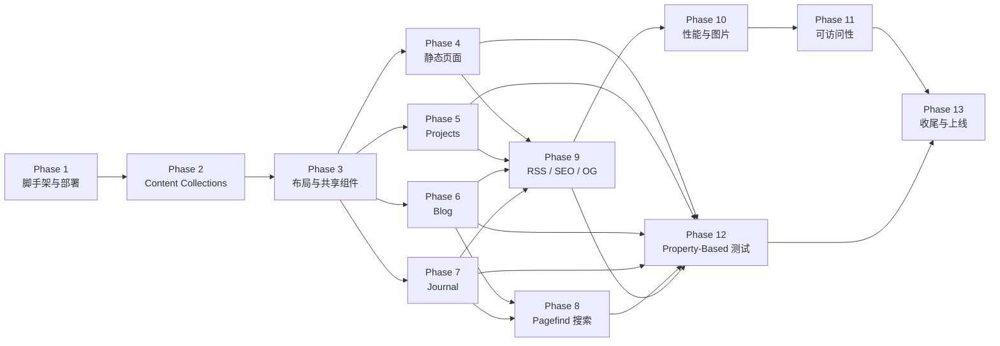

# Implementation Plan

本文档将 design.md 中的架构与组件设计拆解为可执行的实施任务。任务按"Phase 增量交付 + 每步可验证"的原则组织，每个 Phase 产出可部署、可回归的功能单元。

## Task Dependency Graph

测试 Phase（P12）中的每条 Property 对应实现 Phase 的产物；建议在对应实现完成后立即补其 Property 测试（任务项已在各 Phase 内交错安排，P12 是最后的覆盖率收口）。

---

## Phase 1: 脚手架与基础设施

目标：先走通"git push → 构建 → 部署 → 浏览器可访问"的最小闭环，让后续开发始终跑在可部署状态上。

- [ ] 1.1 初始化 Astro 项目骨架
  - 在仓库根目录运行 `pnpm create astro@latest` 生成最小 TypeScript 项目；选择 `Empty` 模板，strict TS。
  - 确认生成 `package.json`、`tsconfig.json`（`strict: true`、`verbatimModuleSyntax: true`）、`astro.config.mjs`。
  - 将 Node 版本固定在 `.nvmrc`（值为 `20`）。
  - Validates: Requirement 20.1

- [ ] 1.2 创建目录结构
  - 按 design.md §Components and Interfaces 的目录结构创建空目录：`src/{pages,layouts,components,content,lib,styles}`、`content/{blog,projects,journal}`、`content/blog/images`、`content/projects/images`、`public`、`scripts`、`.github/workflows`。
  - 为每个关键子目录放一个 `.gitkeep` 以确保提交。
  - Validates: Requirement 12.1

- [ ] 1.3 集成 Tailwind CSS v4
  - 安装 `@tailwindcss/vite`、`@tailwindcss/typography`。
  - 在 `astro.config.mjs` 的 Vite 插件中注册 Tailwind。
  - 创建 `src/styles/global.css`，使用 `@import "tailwindcss"` + 声明 `@theme` 扩展；在文件内定义 design.md §视觉设计系统 的全部 CSS 变量（明色主题默认，暗色主题用 `:root[data-theme="dark"]` 覆盖）。
  - Validates: Requirement 14.1–14.5

- [ ] 1.4 配置字体系统
  - 安装 `@fontsource-variable/inter`、`@fontsource-variable/jetbrains-mono`。
  - 将 Noto Sans SC 子集（常用 3500 字 + 标点）放至 `public/fonts/noto-sans-sc-subset.woff2`，并在 `global.css` 用 `@font-face` 注册，`font-display: swap`。
  - 在 BaseLayout 中 `preload` Inter 与 Noto Sans SC 的 woff2 关键字体。
  - Validates: Requirement 14.7

- [ ] 1.5 配置 astro.config.mjs 基础项
  - 设置 `site: process.env.PUBLIC_SITE_URL`、`output: "static"`、`trailingSlash: "never"`。
  - 安装并注册 `@astrojs/mdx`、`@astrojs/sitemap`。
  - 暂不填充 markdown/shikiConfig（Phase 6 再补）。
  - Validates: Requirement 17.1

- [ ] 1.6 创建 BaseLayout 骨架
  - `src/layouts/BaseLayout.astro`：输出完整 `<html lang="zh-CN">`、`<head>`、`<body>`。
  - `<head>` 必须包含：`<meta charset>`、viewport、一个 props 驱动的 `<title>`、`<meta name="description">`、引用 `global.css`、字体 preload。
  - 在 `<head>` 末尾注入 design.md §8.3 的主题 inline script，设置 `document.documentElement.dataset.theme`。
  - `<body>` 使用 slot 接收页面内容。
  - Validates: Requirement 14.2, 14.3, 14.4

- [ ] 1.7 创建临时 hello world 首页
  - `src/pages/index.astro` 使用 BaseLayout，渲染文本 "Personal Website is live."。
  - 目标是验证构建与部署通路，本页将在 Phase 4 被替换。
  - Depends: 1.6

- [ ] 1.8 配置 package.json 脚本
  - 添加：`dev`、`build`、`preview`、`typecheck` (`tsc --noEmit`)、`lint`、`format`、`validate-content`、`pagefind` (`pagefind --site dist`)、`test`。
  - 安装 `prettier`、`eslint`、`eslint-plugin-astro`、`typescript-eslint`、`vitest`。
  - Validates: Requirement 12.5, 12.6

- [ ] 1.9 创建 CI 流水线
  - `.github/workflows/ci.yml`：按 design.md §Deployment 的 YAML 配置，包含 checkout / pnpm / node 20 / install / typecheck / lint / validate-content / build / test 步骤。
  - PR 与 push main 均触发；PR 额外跑 Lighthouse CI（在 Phase 10 补 lhci 配置）。
  - Validates: Requirement 20.2

- [ ] 1.10 配置 Cloudflare Pages 部署
  - 在仓库 README 中记录：Build command `pnpm build && pnpm pagefind`、Output `dist`、Node `20`、Production branch `main`、所需环境变量 `PUBLIC_SITE_URL`。
  - 推送一次 main 分支，在 Cloudflare 控制台完成项目创建与绑定，确认构建成功并可访问临时域名。
  - Validates: Requirement 20.1, 20.2, 20.5

- [ ] 1.11 编写 robots.txt
  - `public/robots.txt`：`User-agent: *` / `Allow: /` / `Sitemap: https://<site>/sitemap.xml`。
  - Validates: Requirement 17.2

---

## Phase 2: Content Collections 与数据模型

目标：将 design.md §Data Models 中的 8 个 Zod schema 落地为可被 Astro 强校验的 Content Collection，并为每个 collection 建立示例数据，供后续 Phase 页面开发调用。

- [ ] 2.1 创建 content/config.ts 基础结构
  - `src/content/config.ts` 内 `import { defineCollection, z } from "astro:content"`，导出 `collections` 对象。
  - Validates: Requirement 12.1

- [ ] 2.2 定义 blog collection schema
  - 按 design.md §Data Models 中 Blog Post 小节的 Zod schema 落地：`title/date/updated?/category/tags/summary/draft/cover?`，含长度与正则约束。
  - Validates: Requirement 12.2, 12.4, 5.1

- [ ] 2.3 定义 projects collection schema
  - 落地 `title/date/summary/stack/fullStack/demo?/repo?/cover?/draft` 字段与约束。
  - Validates: Requirement 4.1, 4.2, 4.3, 4.4, 4.8, 12.2

- [ ] 2.4 定义 journal collection schema
  - 落地 `date/tags?/draft`。
  - Validates: Requirement 9.1, 9.4, 12.3

- [ ] 2.5 定义 now / skills / uses / resume / site collection schema
  - 按 design.md §Data Models 中对应小节定义各自的 Zod schema；其中 skills 使用 `discriminatedUnion("kind", ...)` 三分支；uses 为字符串数组 + 可选 url；resume 的 `end` 字段用 `z.union([regex, literal("至今")])`。
  - Validates: Requirement 3.1, 3.2, 6.1, 6.2, 6.3, 7.3, 7.5, 8.1, 8.2, 8.3, 10.1, 10.2, 10.3, 10.4

- [ ] 2.6 添加 blog 示例文件
  - `content/blog/2025-01-15-hello-world.mdx`：合法 Front Matter + 含 H2/H3、代码块（带语言 `ts`）、数学公式 `$$ E = mc^2 $$`、相对路径图片引用的正文。
  - `content/blog/images/hello-world-cover.jpg` 放一张占位图。
  - Validates: Requirement 5.6, 5.7, 5.8, 5.12

- [ ] 2.7 添加 projects 示例文件
  - `content/projects/example-project.mdx`：合法 Front Matter + 按顺序的四个 H2：`## 项目背景与要解决的问题` / `## 技术架构与选型理由` / `## 我的角色与个人贡献` / `## 项目成果或影响指标`。
  - Validates: Requirement 4.7

- [ ] 2.8 添加 journal / now / skills / uses / resume / site 示例内容
  - `content/journal/2025-01-20.md`（≤120 字一条 + >120 字一条）、`content/now.md`（三个 H2：现在在做 / 现在在学 / 现在在关注）、`content/skills.yml`（三种 proficiency 形式各至少一例）、`content/uses.yml`、`content/resume.yml`、`content/site.yml`（含 `name/tagline/intro/heroTags/url/email/social`）、`content/about.mdx`（500–2000 字 + 职业背景/职业故事/价值观/技术兴趣/非技术兴趣 H2）。
  - Validates: Requirement 1.1, 1.2, 2.1, 2.4, 7.1, 7.3, 9.1, 9.7

- [ ] 2.9 创建内容校验脚本 validate-content.ts
  - `scripts/validate-content.ts` 使用 Node + `fs`、`gray-matter`、`mdast-util-from-markdown` 实现：
    - Now：文件存在、Front Matter `lastUpdated` 合法、`lastUpdated <= today`、AST H2 序列精确匹配 `["现在在做","现在在学","现在在关注"]`。
    - Projects：每个 entry 的 MDX AST 前四个 H2 精确匹配 `["项目背景与要解决的问题","技术架构与选型理由","我的角色与个人贡献","项目成果或影响指标"]`。
    - About：正文总字数 500–2000、H2 含"职业背景"与"职业故事"、三板块 H2（价值观/技术兴趣/非技术兴趣）存在且每块 ≥ 3 个列表项。
    - Blog/Projects：扫描正文所有相对路径图片引用，断言 `path.resolve(dir, ref)` 对应文件存在。
  - 任何失败 `process.exit(1)` 并输出文件路径 + 失败原因。
  - Validates: Requirement 2.1, 2.4, 4.7, 7.1, 7.5, 7.6, 7.7, 12.8, 12.9

- [ ] 2.10 接入 prebuild
  - 在 `package.json` 中：`"prebuild": "pnpm validate-content"`，确保 `pnpm build` 前自动执行校验。
  - Validates: Requirement 12.6, 12.8, 12.9
  - Depends: 2.9

---

## Phase 3: 布局与共享组件

目标：在实现具体业务页面之前，完成全站共享的布局组件与视觉原子组件。

- [ ] 3.1 实现 Nav 组件（桌面 + 移动折叠）
  - `src/components/Nav.astro`：桌面端 7 项主导航 + Skills/Uses 收入"更多"下拉菜单；移动端（< 768px）折叠为汉堡菜单，展开时呈现全部入口；当前页入口应有 `aria-current="page"` + 下划线 + `--color-accent` 样式。
  - 使用单一 Island（`client:media` 仅在移动视口激活）处理菜单开合。
  - Validates: Requirement 11.1, 11.2, 11.3, 11.5, 11.6, 11.7, 11.8

- [ ] 3.2 实现 Footer 组件（Contact_Section）
  - `src/components/Footer.astro`：从 `content/site.yml` 读取 email/github/linkedin/twitter；未配置的社交平台不渲染；所有外链 `target="_blank" rel="noopener"`；邮箱 `mailto:` 点击后 500ms 内 `visibilitychange` 未触发则显示 toast + 复制到剪贴板。
  - 页脚底部展示两个 RSS 链接 `/feed.xml` 与 `/journal/feed.xml` 及 sitemap 入口。
  - Validates: Requirement 10.1–10.10, 11.4, 16.6

- [ ] 3.3 实现 ThemeToggle Island
  - `src/components/ThemeToggle.astro` + 客户端脚本：切换 `document.documentElement.dataset.theme` 并写入 `localStorage.theme`；按钮呈现当前主题图标。
  - Validates: Requirement 14.4

- [ ] 3.4 完善 BaseLayout
  - 在 1.6 的骨架基础上注入 Nav、Footer、Skip Link（`<a href="#main" class="sr-only focus:not-sr-only">跳到主内容</a>`）。
  - 接受 props：`title` / `description` / `ogImage?` / `canonical?`，为每页自动生成 `<title>`（唯一）、`<meta name="description">`、OG 五项 + Twitter Card 四项 + canonical。
  - 在 `<head>` 声明两个 RSS `<link rel="alternate" type="application/rss+xml">` 指向 `/feed.xml` 与 `/journal/feed.xml`。
  - Validates: Requirement 16.6, 17.3, 17.4, 17.5, 17.7, 21.3

- [ ] 3.5 实现原子组件：Tag / BlogCard / ProjectCard / JournalItem / SkillBar / Timeline / Prose
  - 按 design.md §Components and Interfaces 分别实现，样式走 CSS Variables + Tailwind Utility；正文容器 Prose 使用 `@tailwindcss/typography` 并覆盖为极简风（削弱引号装饰、压扁标题字重）。
  - SkillBar 将三种 proficiency 映射到同一 0–100 的 14 格灰阶条。
  - Validates: Requirement 6.2, 6.3, 13.4, 14.7

- [ ] 3.6 实现 404 页
  - `src/pages/404.astro`：展示"404 / 这里什么都没有。"+ 返回 Home / Blog / Journal 三个链接。
  - Validates: Requirement 22.1, 22.2, 22.3, 22.4

- [ ] 3.7 验证 CSS 动效时长 ≤ 300ms
  - 人工检查所有 CSS 中 `transition-duration` / `animation-duration` 值；配合 Phase 12 的自动化断言。
  - Validates: Requirement 14.6
  - Property: P18

---

## Phase 4: 静态页面

- [ ] 4.1 实现 Home_Page
  - `src/pages/index.astro`：Hero（姓名/身份定位/简介/标签/Now 入口）+ 近期项目（≤3）+ 近期文章（≤5）+ 近期日志（≤3）。
  - 数据从 `site.yml` + 对应 collection 查询（filter draft、sortDesc by date、take N）。
  - 每区块若为空则渲染占位文案（长度 1–50 字）并保留列表页入口。
  - 首屏高度 ≥ 900px 且宽度 ≥ 1280px 下 Hero 不触发滚动；使用 `min-height: 100svh`。
  - Validates: Requirement 1.1–1.9

- [ ] 4.2 实现 About_Page
  - `src/pages/about.astro`：渲染 `content/about.mdx`；头像从 `public/avatar.jpg` 加载，alt 描述站主；若头像加载失败，`onerror` 切换至 SVG 占位；在页面底部渲染 Contact_Section（复用 Footer 的联系方式组件）。
  - Validates: Requirement 2.1, 2.2, 2.3, 2.4, 2.5

- [ ] 4.3 实现 Resume_Page
  - `src/pages/resume.astro`：读取 `content/resume.yml`，按起始时间倒序渲染工作经历与教育经历时间线；显示粘性"下载 PDF 简历"按钮。
  - PDF 按钮通过 Island 在 mount 时 `fetch(HEAD /resume.pdf)` 预检，404 时禁用并展示"暂不可下载"提示；点击下载后浏览器文件名规则由静态文件名决定（`public/resume.pdf`，建议站主命名为 `${name}-resume.pdf`）。
  - Validates: Requirement 3.1, 3.2, 3.3, 3.4, 3.5

- [ ] 4.4 实现 Now_Page
  - `src/pages/now.astro`：读取 `content/now.md`，顶部展示 `最后更新：YYYY-MM-DD`；若 `diffDays(today, lastUpdated) > 90` 在三板块之前渲染过期提示条（细灰框 + 左侧 accent 竖线）。
  - 渲染三板块 H2，不允许额外 H2（由 validate-content 强制）。
  - Validates: Requirement 7.1, 7.2, 7.3, 7.4

- [ ] 4.5 实现 Skills_Page
  - `src/pages/skills.astro`：读取 `content/skills.yml`，按固定类别顺序渲染分组；每个 skill 通过 SkillBar 同时展示名称与熟练度；空分组不渲染标题。
  - Validates: Requirement 6.1, 6.2, 6.3, 6.5

- [ ] 4.6 实现 Uses_Page
  - `src/pages/uses.astro`：读取 `content/uses.yml`，按分组渲染；无 url 的 item 仅显示名称与评价；空分组不渲染容器与标题；外链 `target="_blank" rel="noopener"`。
  - Validates: Requirement 8.1, 8.2, 8.3, 8.5, 8.7

---

## Phase 5: Projects（动态页面）

- [ ] 5.1 实现 /projects 列表
  - `src/pages/projects/index.astro`：读取 `projects` collection，filter draft，按 `date` 倒序、同日按 `title` 升序；每张卡片含封面（缺失用默认占位）、名称、简介、stack 标签（≤6）、Demo/Repo 外链（缺失不渲染）；空状态提示。
  - Validates: Requirement 4.1, 4.2, 4.3, 4.4, 4.10, 4.12

- [ ] 5.2 实现 /projects/[slug] 详情页
  - `src/pages/projects/[slug].astro`：使用 `getStaticPaths` 预渲染所有非 draft 项目；渲染 Front Matter 头部（标题/简介/fullStack/Demo/Repo）+ MDX 正文；正文外部链接自动 `target="_blank"`。
  - 当访问不存在 slug 时由 Astro 输出 404。
  - Validates: Requirement 4.5, 4.6, 4.7, 4.8, 4.9, 4.11

---

## Phase 6: Blog 系统

- [ ] 6.1 配置 MDX 管道
  - 在 `astro.config.mjs` 的 `markdown` 字段按 design.md §8.1 注册 remark/rehype 插件链：`remark-gfm` / `remark-smartypants` / `remark-math` / `rehype-slug` / `rehype-autolink-headings` / `rehype-katex` / `rehype-external-links`。
  - 配置 shiki：themes light/dark、langs 九项 + text 兜底、wrap true。
  - 在 `global.css` 引入 `katex/dist/katex.min.css`。
  - Validates: Requirement 5.6, 5.7, 5.8, 5.9, 4.6, 8.5, 10.7

- [ ] 6.2 实现 readingTime 工具
  - `src/lib/readingTime.ts`：函数签名 `readingTime(zhChars: number, enWords: number): number`，公式 `Math.max(1, Math.ceil(zhChars / 300 + enWords / 200))`。
  - 同文件导出 `estimateFromMarkdown(body: string)`，区分中英文字符计数。
  - Validates: Requirement 5.11
  - Property: P13

- [ ] 6.3 实现 /blog 列表页
  - `src/pages/blog/index.astro`：按日期倒序渲染；顶部 Category Pills（当前所有非 draft 文章覆盖的分类）+ Tag Pills；摘要截断至 150 字符；空态提示。
  - Validates: Requirement 5.1, 5.2, 5.3, 5.13

- [ ] 6.4 实现 /blog/[slug] 文章页
  - `src/pages/blog/[slug].astro`：渲染正文 prose、元信息（发布日期 YYYY-MM-DD / 最后更新日期 / 分类 / 标签 / 阅读时长）。
  - 正文容器加 `data-pagefind-body` 与 `data-pagefind-meta="source:Blog"`、`data-pagefind-filter="category:<cat>"`。
  - 图片加 `loading="lazy" decoding="async"`，封面首屏 `loading="eager" fetchpriority="high"`；图片加载失败 onerror 显示占位并保留 alt。
  - Validates: Requirement 5.6–5.12, 5.14, 5.15

- [ ] 6.5 实现 TOC Island
  - `src/components/TOC.astro` + 客户端脚本：读取正文中 H2–H4 标题与 id，渲染有序目录；点击定位；IntersectionObserver 监控当前可视标题并高亮当前项。
  - 仅 Desktop 显示，Mobile/Tablet 折叠为顶部 `
`。
  - Validates: Requirement 5.9

- [ ] 6.6 实现 ReadingProgress Island
  - `src/components/ReadingProgress.astro` + 客户端脚本：基于 `IntersectionObserver` + scroll 计算视口底部相对于正文起止范围的百分比（0–100 整数），写入顶部进度条 `width`。
  - Validates: Requirement 5.10

- [ ] 6.7 实现 /blog/category/[category] 与 /blog/tag/[tag]
  - `src/pages/blog/category/[category].astro` 与 `src/pages/blog/tag/[tag].astro`：用 `getStaticPaths` 聚合所有非 draft 文章的分类/标签集合；每个页面复用列表组件，仅过滤一次集合。
  - Validates: Requirement 5.4, 5.5

---

## Phase 7: Journal 系统

- [ ] 7.1 实现 /journal 列表
  - `src/pages/journal/index.astro`：按日期倒序渲染所有非 draft 条目；顶部标签筛选 Pills + "全部"入口；空状态文案"暂无日志"。
  - 每条 Journal_Entry 展示 `YYYY-MM-DD` + tags（若有）+ 正文；>120 字符截断并附"展开全文"入口（Island 控制展开）。
  - 容器加 `data-pagefind-body` 与 `data-pagefind-meta="source:Journal"`。
  - Validates: Requirement 9.1–9.9

- [ ] 7.2 实现 /journal/tag/[tag]
  - `getStaticPaths` 聚合所有非 draft 条目的 tags 集合；每页仅过滤一次集合。
  - Validates: Requirement 9.6

---

## Phase 8: Pagefind 搜索

- [ ] 8.1 集成 Pagefind 构建步骤
  - 安装 `pagefind` 为 devDependency；在 `package.json` 中 `"pagefind": "pagefind --site dist"`；在 Cloudflare Pages 构建命令中改为 `pnpm build && pnpm pagefind`。
  - 验证构建后 `dist/pagefind/` 目录产生。
  - Validates: Requirement 15.1, 15.2

- [ ] 8.2 实现 /search 页面与 Search Island
  - `src/pages/search.astro`：静态壳 + `<Search>` Island 以 `client:load` 加载。
  - Island 在首次聚焦搜索框时动态 `import("/pagefind/pagefind.js")`；输入后 debounce 200ms 触发查询；结果列表按相关度倒序，每项显示标题（Journal 无标题时用正文前 120 字）+ 来源类型徽章（Blog / Journal）+ 摘要。
  - 空结果展示"未找到匹配内容"；动态 import 失败展示"搜索暂不可用"。
  - Validates: Requirement 15.1–15.6, 22.5

- [ ] 8.3 将 Search 入口接入 Nav
  - 在 Nav 的桌面与移动布局均提供搜索入口按钮/图标，点击跳转 `/search` 或打开搜索浮层。
  - Validates: Requirement 15.1

---

## Phase 9: RSS / Sitemap / SEO / OG

- [ ] 9.1 生成 Blog RSS
  - `src/pages/feed.xml.ts`：使用 `@astrojs/rss`，取 blog collection 非 draft 前 20 篇，含 title/link/pubDate/author/description。
  - Validates: Requirement 16.1, 16.2, 16.3

- [ ] 9.2 生成 Journal RSS
  - `src/pages/journal/feed.xml.ts`：取 journal collection 非 draft 前 20 条，含 link/pubDate/author/description/tags。
  - Validates: Requirement 16.4, 16.5

- [ ] 9.3 启用 sitemap
  - 确认 `@astrojs/sitemap` 已在 integrations 注册，`filter` 排除 `/404` 与任何 draft 路径；构建后检查 `dist/sitemap-index.xml` 与 `dist/sitemap-0.xml`。
  - Validates: Requirement 17.1
  - Depends: 1.5

- [ ] 9.4 在 BaseLayout 注入 Blog JSON-LD
  - PostLayout（或 Blog_Post_Page 模板）在 `<head>` 写入 `<script type="application/ld+json">`，内容含 `@context/@type: "BlogPosting"/headline/datePublished/dateModified?/author`。
  - Validates: Requirement 17.6

- [ ] 9.5 准备默认 OG 图
  - `public/og-default.png`（1200×630 黑白纯排版），所有页面默认指向；在 BaseLayout 的 OG meta 中作为兜底。
  - Validates: Requirement 17.4, 17.5

- [ ] 9.6 实现博客文章 OG 自动生成
  - 安装 `satori` + `@resvg/resvg-js`；脚本 `scripts/og-generate.ts` 根据 blog collection 渲染每篇文章的 OG 图（标题 + 发布日期 + 站名），输出至 `dist/og/<slug>.png`。
  - 在 astro integration 的 `astro:build:done` hook 触发脚本；Blog_Post_Page 的 `og:image` 指向 `/og/<slug>.png`。
  - Validates: Requirement 17.4

---

## Phase 10: 性能与图片策略

- [ ] 10.1 配置 astro:assets 响应式变体
  - 在 BlogCard / ProjectCard / Blog_Post_Page / Project_Detail_Page 等使用 `<Image>` 或 `<Picture>` 组件，指定 widths `[320, 640, 960, 1280]`、formats `["avif","webp"]`。
  - Hero 图 `loading="eager" fetchpriority="high"`，正文图 `loading="lazy" decoding="async"`。
  - Validates: Requirement 18.6, 18.7

- [ ] 10.2 字体子集 preload 与 font-display
  - 确认 1.4 中的字体文件在 `<head>` 以 `<link rel="preload" as="font" crossorigin>` 预加载；所有 `@font-face` 声明 `font-display: swap`。
  - Validates: Requirement 18.1, 18.2

- [ ] 10.3 集成 Lighthouse CI
  - 添加 `lighthouserc.json`：目标 Performance/SEO/Accessibility ≥ 90，Home 与任一 Blog_Post_Page 都跑；在 `.github/workflows/ci.yml` 的 PR job 中运行 `lhci autorun`。
  - Validates: Requirement 18.1, 18.2, 18.3, 18.4

- [ ] 10.4 验证 LCP ≤ 2.5s（Fast 3G）
  - 本地 `pnpm build && pnpm preview`，Chrome DevTools Performance → Throttle Fast 3G → 测 Home LCP；不达标则调整字体子集、Hero 图尺寸或预加载策略。
  - Validates: Requirement 18.5

---

## Phase 11: 可访问性

- [ ] 11.1 Skip Link 与语义化标签审计
  - 确认所有页面的 `<main id="main">` 唯一；Nav/Footer/Article/Aside 语义标签齐全；Skip Link 在 Tab 首次按下后可见聚焦。
  - Validates: Requirement 21.2, 21.3

- [ ] 11.2 对比度人工校验
  - 使用 DevTools → Lighthouse → Accessibility 审计 Home/Blog_List_Page/Blog_Post_Page 三个页面在明暗两种主题下的对比度；如有不达标则回到色板微调。
  - Validates: Requirement 21.4

- [ ] 11.3 键盘导航 Tab 顺序验证
  - 对 Home/Blog_Post_Page 使用纯键盘（Tab、Shift+Tab、Enter、Esc）完整浏览一次；每个交互元素焦点可见且可激活。
  - Validates: Requirement 10.10, 21.3

---

## Phase 12: Property-Based 与 Integration 测试

- [ ] 12.1 安装并配置 Vitest
  - 添加 `vitest`、`@vitest/ui`、`fast-check`、`linkedom`、`jsdom`、`happy-dom`；`vitest.config.ts` 设置 workspace、env node、globals true。
  - 目录规范：`tests/property/*.test.ts`、`tests/integration/*.test.ts`、`tests/unit/*.test.ts`。

- [ ] 12.2 安装并配置 Playwright
  - 添加 `@playwright/test`；`playwright.config.ts` 启动 `pnpm preview` 作为 webServer，`baseURL: http://localhost:4321`；workers 2；浏览器 Chromium。

- [ ] 12.3 Property P13：readingTime 纯函数
  - `tests/unit/reading-time.test.ts`：fast-check 对 `(zhChars, enWords)` 生成任意非负整数对，断言 `readingTime` 等于 `Math.max(1, Math.ceil(zhChars/300 + enWords/200))`。
  - Property: P13
  - Validates: Requirement 5.11

- [ ] 12.4 Property P2：Front Matter Schema 校验
  - `tests/integration/schema.test.ts`：使用 fast-check 生成合法与非法的 blog / project / journal / now / skills / uses / resume / site 数据；对合法数据 `astro build` 应成功，对非法数据应失败（在隔离 fixtures 目录构建）。
  - Property: P2
  - Validates: Requirement 6.2, 6.3, 6.6, 7.3, 7.5, 8.2, 8.6, 9.2, 12.2, 12.3, 12.6, 12.8

- [ ] 12.5 Property P1 + P3：列表排序 / 截断 / 草稿排除
  - `tests/property/list-ordering.test.ts`：fast-check 生成随机 blog/project/journal entries（含 draft、同日期），构建后解析 Home/Blog/Projects/Journal 列表 HTML，断言日期单调不增、长度 ≤ K、无 draft slug 出现。
  - Property: P1, P3
  - Validates: Requirement 1.4, 1.5, 1.6, 4.2, 5.1, 9.1, 9.11, 12.4, 16.2

- [ ] 12.6 Property P4：Nav/Footer 全站一致性
  - `tests/integration/nav-consistency.test.ts`：遍历 dist/ 所有 HTML，解析 `<nav>`/`<footer>`，剔除 `aria-current` 后做规范化序列化，断言 unique 集合大小 = 1；断言 nav 主入口顺序 = [Home, About, Resume, Projects, Blog, Journal, Now]。
  - Property: P4
  - Validates: Requirement 11.1, 11.2, 11.7

- [ ] 12.7 Property P5：外链 target/rel
  - `tests/integration/external-links.test.ts`：遍历 dist/ 所有 HTML 中 `<a>`，对 origin 与站点不同的链接断言 `target="_blank"` 且 `rel` 包含 `noopener`。
  - Property: P5
  - Validates: Requirement 4.6, 8.5, 10.7

- [ ] 12.8 Property P6：图片 alt 与资源存在性
  - `tests/integration/images.test.ts`：遍历 dist/ HTML 中 ``，断言 `alt` 属性显式存在；内部路径对应文件存在于 dist/；外部路径为 HTTPS URL。
  - Property: P6
  - Validates: Requirement 2.2, 5.12, 21.1

- [ ] 12.9 Property P7：条件字段 ⇔ UI 元素存在
  - `tests/property/conditional-rendering.test.ts`：fast-check 生成 project entry 的 demo/repo 组合、site.yml 的 social 组合、uses.item.url 组合，构建后断言对应元素存在/不存在的等价性；collection 为空时渲染占位/不渲染分组。
  - Property: P7
  - Validates: Requirement 1.9, 4.3, 4.4, 5.13, 8.3, 8.7, 10.8

- [ ] 12.10 Property P8：死链闭合
  - `scripts/check-links.ts` 在构建后遍历 dist/ 所有 HTML 的内链 `href` 与 fragment，断言目标路径存在、fragment id 存在于目标文档；将脚本接入 `pnpm test`。
  - Property: P8
  - Validates: Requirement 12.1

- [ ] 12.11 Property P9 + P10：SEO 完备性 + JSON-LD
  - `tests/integration/seo.test.ts`：遍历 dist/ HTML，断言每页 title 非空且全站唯一；description、OG 五项、Twitter Card 四项、无 `noindex`、两个 RSS `<link rel="alternate">`；对 Blog_Post_Page 断言 `<script type="application/ld+json">` 存在且 `@type === "BlogPosting"`。
  - Property: P9, P10
  - Validates: Requirement 16.6, 17.3, 17.4, 17.5, 17.6, 17.7

- [ ] 12.12 Property P11：Sitemap 完备性
  - `tests/integration/sitemap.test.ts`：解析 dist/sitemap*.xml 的 `<loc>` 集合与 dist/ 中所有 `index.html` 路径集合（排除 /404），断言两集合相等。
  - Property: P11
  - Validates: Requirement 17.1

- [ ] 12.13 Property P12：Skills 渲染一致性
  - `tests/property/skills.test.ts`：fast-check 合成 skills.yml，构建后解析 `/skills/index.html`，断言 group 顺序一致、每个 item 名称在对应分组 DOM 子树中、每个 skill 同时含 name 与 proficiency 表达。
  - Property: P12
  - Validates: Requirement 6.1, 6.3, 6.5

- [ ] 12.14 Property P14：Now 过期提示
  - `tests/integration/now-stale.test.ts`：注入不同 `lastUpdated`（90 天内、正好 90 天、>90 天），构建后断言过期条的存在/缺失与 `diffDays > 90` 等价。
  - Property: P14
  - Validates: Requirement 7.4

- [ ] 12.15 Property P15：分类/标签页集合等价
  - `tests/property/tag-pages.test.ts`：fast-check 生成 blog/journal entries，构建后对每个 `/blog/category/[c]` / `/blog/tag/[t]` / `/journal/tag/[t]` 页面断言渲染的条目集合与源过滤结果集合相等。
  - Property: P15
  - Validates: Requirement 5.4, 5.5, 9.6

- [ ] 12.16 Property P16：MDX 管道
  - `tests/integration/mdx.test.ts`：注入一篇 MDX fixture（含九语言代码块 + 未标记代码块 + `$$ ... $$` 数学 + H2/H3/H4 标题 + 图片），构建后断言 shiki `` 存在、未标记代码块以 `<pre><code>` 形式存在、`.katex` 子树存在、H2–H4 带 `id`。
  - Property: P16
  - Validates: Requirement 5.6, 5.7, 5.8, 5.9

- [ ] 12.17 Property P17：Journal 摘要截断与展开入口
  - `tests/property/journal-truncate.test.ts`：fast-check 生成正文长度分布，构建后解析 `/journal/index.html`，断言 ≤120 字整条显示无"展开全文"、>120 字截断为 120 字符 + "展开全文"。
  - Property: P17
  - Validates: Requirement 9.7, 9.8

- [ ] 12.18 Property P18：CSS 动效时长 ≤ 300ms
  - `tests/integration/css-duration.test.ts`：构建后读取 dist/ 下所有 `.css`，正则提取 `transition-duration` / `animation-duration`，解析为毫秒后断言每个值 ≤ 300。
  - Property: P18
  - Validates: Requirement 14.6

- [ ] 12.19 Property P19：响应式无横向滚动 + 字号 ≥ 16px
  - `tests/e2e/responsive.spec.ts`（Playwright）：对 Home/Blog/Blog_Post_Page/Journal 在视口 375/768/1280 下断言 `document.documentElement.scrollWidth <= window.innerWidth`；Mobile 下抽样正文元素 `computedStyle.fontSize` ≥ 16px。
  - Property: P19
  - Validates: Requirement 13.1, 13.2, 13.3, 13.5

- [ ] 12.20 Property P20：图片 srcset 多变体
  - `tests/integration/srcset.test.ts`：遍历 dist/ HTML 中 ``，解析候选数 ≥ 2，且至少含一个 ≤ 768w 与一个 ≥ 1024w。
  - Property: P20
  - Validates: Requirement 18.6

- [ ] 12.21 E2E 烟雾测试
  - `tests/e2e/smoke.spec.ts`（Playwright）：依次访问所有路由；断言 200 状态；点击 ThemeToggle 验证 `data-theme` 切换且 localStorage 写入；聚焦搜索框触发 Pagefind 动态加载；从 Home 的"查看全部"链接能到达 Blog/Projects/Journal 列表。
  - Validates: Requirement 14.4, 15.1, 22.1

---

## Phase 13: 收尾与上线

- [ ] 13.1 编写 README.md
  - 覆盖：本地开发（`pnpm dev`）、新增博客/日志/项目的步骤、Front Matter 字段说明、如何替换头像/简历 PDF/OG 默认图、Cloudflare Pages 部署步骤、自定义域名与 HTTPS 配置、环境变量。
  - Validates: Requirement 20.4

- [ ] 13.2 绑定自定义域名
  - 按 README 的步骤在 Cloudflare Pages 控制台绑定自定义域名；确认 HTTPS 证书自动签发；更新 `PUBLIC_SITE_URL` 并触发重新部署。
  - Validates: Requirement 20.4, 20.5

- [ ] 13.3 最终验收
  - 在生产域名依次打开：Home / About / Resume（下载 PDF）/ Projects 与详情 / Blog 与详情 / Skills / Now / Uses / Journal / Search / 404。
  - 跑一次 Lighthouse，确认四项 ≥ 90。
  - 验证两个 RSS feed 可被 RSS 阅读器订阅。
  - Validates: Requirement 18.1, 18.2, 18.3, 18.4, 16.1, 16.4

---

## Requirement × Task 追溯矩阵

| Requirement | 主要实施 Task | 属性测试 Task |
|---|---|---|
| R1 首页 | 4.1 | 12.5, 12.9 |
| R2 关于我 | 4.2, 2.9 | 12.8 |
| R3 简历 | 4.3, 2.9 | — |
| R4 项目 | 5.1, 5.2, 2.9 | 12.5, 12.7, 12.8, 12.9 |
| R5 博客 | 6.1–6.7 | 12.3, 12.5, 12.7, 12.8, 12.15, 12.16 |
| R6 技能栈 | 4.5 | 12.4, 12.13 |
| R7 Now | 4.4, 2.9 | 12.4, 12.14 |
| R8 Uses | 4.6 | 12.4, 12.7, 12.9 |
| R9 日志 | 7.1, 7.2 | 12.5, 12.15, 12.17 |
| R10 联系方式 | 3.2 | 12.6, 12.7, 12.9 |
| R11 导航 | 3.1, 3.4 | 12.6 |
| R12 内容发布流程 | 2.1–2.10, 1.9 | 12.4, 12.5, 12.10 |
| R13 响应式 | 3.1, 3.4, 3.5 | 12.19 |
| R14 主题与视觉 | 1.3, 1.6, 3.3, 3.4 | 12.18 |
| R15 搜索 | 8.1, 8.2, 8.3 | 12.21 |
| R16 RSS | 9.1, 9.2, 3.4 | 12.11 |
| R17 SEO | 9.3, 9.4, 9.5, 9.6, 3.4 | 12.11, 12.12 |
| R18 性能 | 10.1, 10.2, 10.3, 10.4 | 12.20 |
| R19 访问统计 | 13.1 | — |
| R20 部署 | 1.9, 1.10, 13.2 | — |
| R21 可访问性 | 3.4, 11.1, 11.2, 11.3 | 12.8 |
| R22 错误处理 | 3.6, 8.2 | 12.5, 12.21 |

## Property × Test Task 追溯矩阵

| Property | 测试 Task |
|---|---|
| P1 列表排序+截断+草稿过滤 | 12.5 |
| P2 Schema 校验 | 12.4 |
| P3 Draft 排除全局 | 12.5 |
| P4 Nav/Footer 一致性 | 12.6 |
| P5 外链 target/rel | 12.7 |
| P6 图片 alt + 存在性 | 12.8 |
| P7 条件字段 ⇔ UI | 12.9 |
| P8 死链闭合 | 12.10 |
| P9 SEO 完备 | 12.11 |
| P10 BlogPosting JSON-LD | 12.11 |
| P11 Sitemap 完备 | 12.12 |
| P12 Skills 渲染一致 | 12.13 |
| P13 readingTime 公式 | 12.3 |
| P14 Now 过期提示 | 12.14 |
| P15 分类/标签页集合等价 | 12.15 |
| P16 MDX 管道 | 12.16 |
| P17 Journal 截断+展开 | 12.17 |
| P18 CSS duration ≤ 300ms | 12.18 |
| P19 响应式无横向滚动 | 12.19 |
| P20 图片 srcset | 12.20 |
